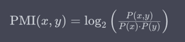
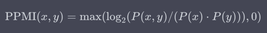

# Semantica vettoriale

### Indice degli Argomenti

* [Semantica vettoriale](#semantica-vettoriale)
    * [Indice degli Argomenti](#indice-degli-argomenti)
    * [Relazioni tra Sensi delle Parole](#relazioni-tra-sensi-delle-parole)
    * [WordNet](#wordnet)
        * [Utilizzare WordNet nell'Elaborazione del Linguaggio Naturale (NLP)](#utilizzare-wordnet-nellelaborazione-del-linguaggio-naturale-nlp)
    * [Word similarity](#word-similarity)
        * [Distanza e similarità](#distanza-e-similarità)
        * [Similarità con WordNet](#similarità-con-wordnet)
        * [Problemi di similarità con Thesaurus](#problemi-di-similarità-con-thesaurus)
    * [Embedding di parole](#embedding-di-parole)
        * [La dimensione di un embedding](#la-dimensione-di-un-embedding)
        * [Term document matrix](#term-document-matrix)
        * [Dimensioni dei vettori](#dimensioni-dei-vettori)
    * [TF-IDF e PMI](#tf-idf-e-pmi)
        * [Vettori sparsi e densi](#vettori-sparsi-e-densi)
        * [PMI](#pmi)
        * [PPMI](#ppmi)
    * [La matrice delle co-occorrenze](#la-matrice-delle-co-occorrenze)
    * [Coseno di similitudine](#coseno-di-similitudine)
        * [Spiegato "semplice"](#spiegato-semplice)

---

## Relazioni tra Sensi delle Parole

Le parole possono avere vari sensi, e questi sensi possono essere collegati da diverse relazioni semantiche:

1. **Omonimia**: Due o più parole con la stessa forma scritta o suono, ma significati diversi. Esempio: "banco" (
   panchina) e "banco" (istituzione finanziaria).

2. **Polisemia**: Una parola ha più di un significato correlato. Esempio: "mano" (organo del corpo e lancetta
   dell'orologio).

3. **Iponimia/Iperonimia**: Gerarchia tra sensi delle parole, con un termine più generale (iperonimo) che comprende
   termini più specifici (iponimi). Esempio: "animale" (iperonimo) - "cane," "gatto" (iponimi).

4. **Sinonimia**: Due o più parole con significati simili o equivalenti. Esempio: "felice" e "contento" sono sinonimi.

5. **Antonimia**: Due parole con significati opposti. Esempio: "caldo" e "freddo" sono antonimi.

6. **Associatività**: I sensi di una parola sono associati per contesto o esperienza comune, anche se non sono sinonimi
   o antonimi. Esempio: "caffè" e "zucchero" sono spesso associati.

Comprendere queste relazioni semantiche è fondamentale nell'elaborazione del linguaggio naturale per catturare
accuratamente il significato delle parole in diversi contesti.

---

## WordNet

WordNet è un database lessicale e una risorsa linguistica ampiamente utilizzata nell'ambito del Natural Language
Processing (NLP) e dell'elaborazione del linguaggio naturale. È stato sviluppato presso l'Università di Princeton ed è
progettato per organizzare le parole della lingua inglese in una struttura gerarchica basata sui concetti e stabilire
relazioni semantiche tra di esse. Alcune delle sue caratteristiche principali includono:

- **Struttura a Iperonimi e Iponimi**: WordNet organizza le parole in un'albero gerarchico in cui i concetti più
  generali (iperonimi) sono situati in cima e i concetti più specifici (iponimi) sono posti più in basso. Questo tipo di
  struttura permette di esplorare i concetti a diversi livelli di astrazione.

- **Sensi Multipli**: WordNet cattura i diversi sensi delle parole e li assegna a voci separate. Ad esempio, una parola
  come "banco" avrà voci diverse per i sensi legati a "panchina" e "istituzione finanziaria".

- **Relazioni Semantiche**: WordNet fornisce una serie di relazioni semantiche tra i concetti, tra cui sinonimia,
  antonimia, iperonimia e iponimia.

- **Sinonimi e Antonimi**: WordNet è noto per la sua raccolta di sinonimi (parole con significati simili) e antonimi (
  parole con significati opposti), utili per la disambiguazione del significato delle parole in un contesto specifico.

- **Utilizzo nell'NLP**: WordNet è utilizzato ampiamente nell'NLP per attività come la lemmatizzazione, la
  disambiguazione semantica, la traduzione automatica e l'estrazione di informazioni. Aiuta a comprendere e manipolare
  il significato delle parole nei testi.

WordNet non è limitato solo all'inglese; esistono anche versioni di WordNet per altre lingue, sebbene l'edizione in
lingua inglese sia la più completa e ampiamente utilizzata. In sintesi, WordNet è una preziosa risorsa linguistica che
aiuta a organizzare e comprendere la struttura semantica delle parole in una lingua specifica, rendendolo uno strumento
chiave nell'elaborazione del linguaggio naturale e nella ricerca linguistica.

Il livello gerarchico più alto di WordNet è chiamato "Top Level Ontology" o "Hypernym Level". A questo livello, troverai
concetti molto generici che costituiscono la base per la gerarchia di WordNet. Uno dei concetti principali a questo
livello è il termine "Entity" (Entità), che rappresenta la categoria più generica possibile. "Entity" è un iperonimo di
quasi tutti gli altri concetti in WordNet.

Ecco un esempio di gerarchia di WordNet con il livello "Entity" come radice:

```
- Entity (Entità)
  - Physical Entity (Entità Fisica)
    - Object (Oggetto)
      - ... (altri concetti relativi agli oggetti)
    - Substance (Sostanza)
      - ... (altri concetti relativi alle sostanze)
  - Abstract Entity (Entità Astratta)
    - ... (altri concetti relativi alle entità astratte)
```

In questa gerarchia semplificata, "Entity" è il livello più alto, seguito da "Physical Entity" e "Abstract Entity".
Sotto "Physical Entity", ci sono ulteriori categorie come "Object" e "Substance", mentre sotto "Abstract Entity" ci sono
altre entità astratte.

Questo livello di astrazione è utile per comprendere la struttura di base di WordNet e per stabilire relazioni tra i
concetti in modo più generale. Successivamente, è possibile scendere nella gerarchia per trovare concetti più specifici,
ad esempio, oggetti specifici o entità astratte particolari.

### Utilizzare WordNet nell'Elaborazione del Linguaggio Naturale (NLP)

WordNet è una preziosa risorsa linguistica utilizzata nell'ambito del Natural Language Processing (NLP) per svolgere
diverse attività legate all'analisi e alla comprensione del linguaggio naturale. Ecco alcune delle modalità principali
in cui puoi utilizzare WordNet:

- **Lemmatizzazione**: WordNet semplifica la lemmatizzazione, ovvero la riduzione delle parole alle loro forme base o
  lemmi, per normalizzare il testo e semplificare l'analisi.

- **Disambiguazione Semantica**: WordNet aiuta a risolvere l'ambiguità semantica nelle parole, consentendo di
  identificare il significato appropriato di una parola in un contesto specifico.

- **Traduzione Automatica**: WordNet è utile nelle applicazioni di traduzione automatica per trovare sinonimi e parole
  equivalenti nella lingua di destinazione.

- **Recupero dell'Informazione**: Puoi migliorare la ricerca di informazioni utilizzando WordNet per espandere le query
  di ricerca con sinonimi e termini correlati.

- **Analisi del Testo e Ragionamento**: WordNet facilita l'analisi semantica, la classificazione dei testi e la
  costruzione di ontologie e grafi semantici per il ragionamento.

- **Apprendimento Automatico**: WordNet arricchisce i dati di addestramento per algoritmi di apprendimento automatico,
  aggiungendo informazioni semantiche.

Per utilizzare WordNet, puoi sfruttare librerie e strumenti specifici per il tuo linguaggio di programmazione. Ad
esempio, Python offre la libreria NLTK (Natural Language Toolkit) per accedere a WordNet e sfruttarne le funzionalità.

Ecco un esempio semplice di lemmatizzazione in Python utilizzando NLTK:

```python
import nltk
from nltk.corpus import wordnet

nltk.download('wordnet')  # Scarica WordNet se necessario

word = "running"
lemma = wordnet.lemmatize(word, wordnet.VERB)
print("Lemma di 'running':", lemma)
```

---

## Word similarity

"Word similarity" (similitudine tra parole) è una misura che indica quanto due parole siano simili o correlate in
termini di significato. Questa misura è utilizzata nell'ambito del Natural Language Processing (NLP) e dell'elaborazione
del linguaggio naturale per quantificare la somiglianza semantica tra parole. La similitudine tra parole è una parte
importante di molte applicazioni NLP, come il riconoscimento delle relazioni semantiche tra concetti, la ricerca di
informazioni, la traduzione automatica e la raccomandazione di parole chiave.

Ci sono diverse metodologie per calcolare la similitudine tra parole, e queste possono variare in complessità a seconda
degli obiettivi e delle risorse disponibili. Alcuni dei metodi più comuni includono:

1. **Misure basate sulla distanza**: Questi metodi calcolano la similitudine tra parole in base alla distanza tra di
   esse in uno spazio semantico. Ad esempio, la distanza coseno calcola l'angolo tra i vettori di rappresentazione delle
   parole. Parole con angoli simili sono considerate simili in termini di significato.

2. **Metodi basati su Word Embeddings**: Gli embedding di parole (come Word2Vec, GloVe, o FastText) forniscono
   rappresentazioni vettoriali delle parole in uno spazio semantico continuo. La similitudine tra parole può essere
   calcolata utilizzando la similarità coseno tra i loro vettori di embedding.

3. **Metodi basati su Thesaurus**: Utilizzano risorse lessicali come WordNet per calcolare la similitudine tra parole
   basandosi sulle relazioni lessicali tra di esse. Ad esempio, parole con molti iperonimi in comune in WordNet possono
   essere considerate simili.

4. **Metodi basati su corpus**: Utilizzano statistiche linguistiche dai corpora di testo per calcolare la similitudine
   tra parole. Questi metodi considerano quanto spesso le parole appaiono insieme nei testi.

5. **Reti Neurali**: Alcuni modelli neurali, come le reti neurali siamesi o le reti neurali contrattive, sono addestrati
   specificamente per calcolare la similitudine tra coppie di parole o frasi.

La scelta del metodo di calcolo della similitudine tra parole dipende spesso dall'applicazione specifica e dalle risorse
disponibili. Ad esempio, se si dispone di embedding di parole pre-addestrati, è possibile utilizzarli per calcolare la
similitudine. Tuttavia, se si sta lavorando con testi multilingue o con una lingua per la quale non esistono embedding
pre-addestrati, potrebbe essere necessario utilizzare metodi basati su Thesaurus o altri approcci.

In sintesi, la "word similarity" è una misura che quantifica quanto due parole siano simili in termini di significato,
ed è fondamentale nell'NLP per una vasta gamma di applicazioni.

### Distanza e similarità

La "similarità tra parole" e la "distanza tra le parole" sono due concetti complementari che vengono spesso utilizzati
per valutare le relazioni semantiche tra le parole, ma misurano concetti opposti:

1. **Similarità tra Parole**: La "similarità tra parole" misura quanto due parole siano simili o correlate in termini di
   significato. In altre parole, indica quanto le parole abbiano attributi o significati in comune. Maggiore è la
   similarità, maggiore è il grado di somiglianza semantica tra le parole. I punteggi di similarità sono solitamente
   compresi tra 0 (nessuna similarità) e 1 (massima similarità).

    - Esempio: Le parole "gatto" e "felino" hanno una alta similarità semantica poiché si riferiscono a concetti simili
      o correlati nel contesto degli animali.

2. **Distanza tra Parole**: La "distanza tra le parole" è il complemento della similarità e misura quanto due parole
   siano diverse o lontane in termini di significato. Una "distanza" alta indica che le parole hanno meno in comune dal
   punto di vista semantico. La "distanza" può essere calcolata come l'inverso della similarità o come una misura
   indipendente.

    - Esempio: Le parole "gatto" e "automobile" hanno una distanza semantica elevata poiché si riferiscono a concetti
      molto diversi.

In pratica, queste misure possono essere utilizzate in modi complementari. Ad esempio, quando si valutano le relazioni
semantiche tra parole, è comune calcolare la similarità tra una parola di interesse e una lista di altre parole per
determinare quali sono le più simili. Allo stesso tempo, è possibile calcolare la "distanza" tra due parole per capire
quanto siano lontane in termini di significato.

Le misure di similarità tra parole spesso si basano su misure di "distanza" invertite, come il "cosine similarity" o
il "Pearson correlation coefficient", dove valori più alti indicano una maggiore similarità. In sintesi, mentre la "
similarità tra parole" misura la vicinanza semantica, la "distanza tra le parole" misura la lontananza semantica tra i
concetti rappresentati dalle parole.

### Similarità con WordNet

WordNet offre una ricca struttura gerarchica di concetti lessicali e relazioni semantiche tra di essi, che può essere
sfruttata per calcolare la similarità tra le parole. Un'approccio comune per calcolare la similarità tra parole in
WordNet è utilizzare le relazioni gerarchiche (iperonimia/iponimia) e le distanze semantiche tra i concetti. Ecco alcuni
metodi comuni:

1. **Path Similarity**: Questo metodo calcola la similarità tra due parole basandosi sulla lunghezza del cammino più
   breve tra i loro concetti corrispondenti nella gerarchia di WordNet. Un cammino più corto indica una maggiore
   similarità. Puoi utilizzare l'implementazione di questo metodo in librerie come NLTK (Natural Language Toolkit) in
   Python.

2. **Wu-Palmer Similarity**: Questo metodo è simile al Path Similarity, ma considera anche la profondità dei nodi nella
   gerarchia. Misura la similarità tra due parole in base alla lunghezza del cammino minimo verso il loro antenato
   comune più vicino e la profondità dei nodi nella gerarchia.

3. **Lin Similarity**: Questo metodo utilizza le informazioni della gerarchia di WordNet per calcolare la similarità tra
   due parole. Si basa sulla frequenza relativa delle parole nei concetti coinvolti e nella gerarchia. Può essere
   utilizzato per affrontare il problema dell'assegnazione di un valore di similarità anche quando i concetti sono molto
   specifici.

4. **Resnik Similarity**: Questo metodo calcola la similarità tra due parole utilizzando la probabilità di informazioni
   sulla relazione tra i loro concetti nella gerarchia di WordNet. Misura la similarità in base alla "profondità
   informativa" dei concetti coinvolti.

Ecco un esempio di come calcolare la similarità tra due parole utilizzando la libreria NLTK in Python:

```python
from nltk.corpus import wordnet

# Definisci le due parole da confrontare
word1 = "dog"
word2 = "cat"

# Ottieni i synsets (insiemi di sinonimi) per le due parole
synsets1 = wordnet.synsets(word1)
synsets2 = wordnet.synsets(word2)

# Calcola la similarità tra i synsets (ad esempio, usando Wu-Palmer Similarity)
max_similarity = 0
for synset1 in synsets1:
    for synset2 in synsets2:
        similarity = synset1.wup_similarity(synset2)
        if similarity is not None and similarity > max_similarity:
            max_similarity = similarity

print("Similarità massima tra '{}' e '{}': {}".format(word1, word2, max_similarity))
```

Questo è solo un esempio, e ci sono diverse altre misure di similarità tra parole disponibili in WordNet. La scelta
della misura dipende spesso dall'applicazione specifica e dalle caratteristiche dei dati.

### Problemi di similarità con Thesaurus

L'applicazione di metodi di calcolo di similarità basati su algoritmi di questo tipo può comportare alcuni problemi e
sfide, a seconda delle specifiche dell'applicazione e delle caratteristiche dei dati. Ecco alcuni dei problemi comuni
che possono sorgere:

1. **Sensibilità alla Dimensionalità**: Alcuni algoritmi di calcolo di similarità, come il calcolo del coseno tra
   vettori di parole, possono essere influenzati dalla dimensionalità dei dati. In spazi vettoriali ad alta
   dimensionalità, la similarità tra vettori può tendere a convergere, rendendo difficile distinguere la similarità tra
   parole distinte.

2. **Polysemy e Ambiguità**: Le parole polisemiche (che hanno più di un significato) possono rappresentare una sfida.
   Gli algoritmi di calcolo di similarità potrebbero avere difficoltà a catturare la corretta relazione tra i sensi
   diversi di una parola. La scelta del senso corretto è una sfida nota come "disambiguazione semantica".

3. **Ontologie Limitate**: Molti metodi di calcolo di similarità si basano su risorse lessicali specifiche come WordNet,
   che potrebbero non coprire tutti i concetti o le lingue. Ciò può limitare l'applicabilità dei metodi a lingue o
   domini specifici.

4. **Mancanza di Contesto**: Alcuni metodi di calcolo di similarità non tengono conto del contesto circostante delle
   parole. Due parole possono avere significati simili in un contesto, ma significati diversi in un altro. Questa
   mancanza di considerazione del contesto può portare a misurazioni inaccurate della similarità.

5. **Scelta dell'Algoritmo**: La scelta dell'algoritmo di calcolo di similarità può essere complicata. Diversi algoritmi
   possono produrre risultati diversi a seconda del contesto e degli obiettivi dell'applicazione. È importante
   selezionare l'algoritmo più appropriato per il caso specifico.

6. **Scarsità dei Dati**: In alcuni casi, i dati disponibili per il calcolo di similarità potrebbero essere scarsamente
   rappresentativi o rumore, il che può influire sulla precisione delle misurazioni.

7. **Metriche Arbitrarie**: Alcune metriche di similarità possono essere arbitrarie e non sempre riflettere
   accuratamente le relazioni semantiche tra parole. La scelta delle metriche e dei pesi può influenzare i risultati.

8. **Effetto di Word Frequency**: Alcuni algoritmi di calcolo di similarità possono essere influenzati dalla frequenza
   delle parole nei testi. Parole molto frequenti possono avere una maggiore influenza sulla similarità rispetto a
   parole meno comuni.

Per affrontare questi problemi, è importante considerare attentamente il contesto dell'applicazione e valutare i
risultati del calcolo di similarità in modo critico. Inoltre, è possibile utilizzare tecniche di pre-elaborazione dei
dati, ponderazione delle caratteristiche o algoritmi di calcolo di similarità avanzati per migliorare la precisione e la
rappresentatività delle misurazioni.

---

## Embedding di parole

Un "embedding di una parola" (word embedding) è una rappresentazione numerica continua di una parola all'interno di uno
spazio vettoriale multidimensionale. Questa rappresentazione vettoriale cattura il significato semantico e le relazioni
tra parole in modo che parole simili siano rappresentate da vettori vicini nello spazio vettoriale.

Gli embedding di parole sono ampiamente utilizzati nell'ambito del Natural Language Processing (NLP) e sono fondamentali
per molte applicazioni, tra cui la classificazione di testi, il ragionamento basato sul linguaggio, la traduzione
automatica e la ricerca di informazioni. Ecco alcune caratteristiche chiave degli embedding di parole:

1. **Rappresentazione Numerica**: Ogni parola è rappresentata da un vettore numerico, dove ogni dimensione del vettore
   codifica una caratteristica o un aspetto del significato della parola.

2. **Continuità Semantica**: Parole simili dal punto di vista semantico sono rappresentate da vettori vicini nello
   spazio vettoriale. Questo significa che le operazioni vettoriali (ad esempio, somma o sottrazione di vettori di
   parole) possono catturare relazioni semantiche, come sinonimia o antonimia.

3. **Apprendimento Automatico**: Gli embedding di parole vengono appresi automaticamente da grandi corpora di testo
   utilizzando algoritmi di apprendimento automatico. Alcuni degli algoritmi più noti per l'apprendimento di embedding
   di parole includono Word2Vec, GloVe (Global Vectors for Word Representation), FastText e altri.

4. **Pre-trained Embeddings**: Esistono modelli di embedding di parole pre-addestrati su corpus di testo vasti e
   rappresentativi. Questi modelli possono essere utilizzati direttamente per molte applicazioni NLP senza la necessità
   di addestrare nuovi embedding.

5. **Dimensionalità Configurabile**: La dimensionalità degli embedding di parole può variare a seconda delle esigenze
   dell'applicazione, ma è comune utilizzare dimensioni che vanno da 50 a 300. Dimensioni maggiori possono catturare
   dettagli più fini, ma richiedono più dati per l'addestramento.

Ecco un esempio di un embedding di parola per la parola "king" in uno spazio vettoriale bidimensionale (in realtà, gli
embedding sono multidimensionali e non possono essere visualizzati direttamente):

```
king = [0.4, 0.7]
```

Gli embedding di parole sono fondamentali per migliorare la comprensione delle parole da parte delle macchine nei
contesti NLP e per svolgere attività complesse come il ragionamento e la traduzione automatica. Essi consentono alle
parole di essere rappresentate in modo più significativo e consentono alle macchine di elaborare il significato
semantico del testo in modo più preciso.

### La dimensione di un embedding

La dimensione di un embedding di parole dipende da diverse considerazioni, tra cui:

1. **Dimensionalità dei Dati di Addestramento**: La dimensione di un embedding di parole è spesso determinata dai dati
   di addestramento disponibili. In generale, avere più dimensioni può catturare dettagli più fini nelle relazioni tra
   le parole, ma richiede anche un volume maggiore di dati di addestramento per essere efficace. Se hai una grande
   quantità di dati a disposizione, puoi considerare embedding con dimensioni più elevate.

2. **Complessità dell'Applicazione**: La scelta della dimensione dipende anche dalle esigenze specifiche
   dell'applicazione. Per alcune attività di NLP, come il riconoscimento di entità nomate o la classificazione di testi,
   embedding con dimensioni inferiori (ad esempio 50-100 dimensioni) possono essere sufficienti. Tuttavia, per
   applicazioni più complesse, come la traduzione automatica o il ragionamento basato sul linguaggio, dimensioni più
   elevate (ad esempio 200-300 dimensioni) possono essere più utili.

3. **Rappresentatività Semantica**: Un embedding con più dimensioni può catturare relazioni semantiche più ricche tra le
   parole. Ad esempio, parole con significati simili o parole associate possono essere meglio rappresentate in embedding
   di dimensioni più alte. Questo è importante se l'obiettivo è catturare sfumature semantiche complesse.

4. **Limiti Computazionali**: L'addestramento di embedding con dimensioni elevate richiede più risorse computazionali,
   compreso il tempo di calcolo e la memoria. È importante considerare la capacità di elaborazione del sistema in uso.

5. **Overfitting**: Un embedding con un numero molto elevato di dimensioni può aumentare il rischio di overfitting,
   specialmente se si dispone di dati di addestramento limitati. L'overfitting si verifica quando l'embedding è troppo
   adattato ai dati di addestramento e non generalizza bene su nuovi dati.

6. **Trasferibilità**: Gli embedding di parole pre-addestrati su corpora di testo molto ampi, come Word2Vec o GloVe,
   spesso hanno dimensioni predefinite. Utilizzare embedding pre-addestrati può semplificare il processo e ridurre la
   necessità di selezionare una dimensione specifica.

In generale, la scelta della dimensione dell'embedding è un compromesso tra la complessità del modello e la quantità di
dati disponibili. È comune iniziare con dimensioni più basse (ad esempio 100 dimensioni) e, se necessario, aumentare la
dimensione in base alle prestazioni dell'applicazione e alla quantità di dati di addestramento. L'ottimizzazione della
dimensione dell'embedding può richiedere esperimenti empirici per determinare quale dimensione offre le prestazioni
migliori per una specifica attività di NLP.

### Term document matrix

La "Term-Document Matrix" (TDM), nota anche come "matrice termine-documento," è una rappresentazione tabulare utilizzata
nell'ambito del Natural Language Processing (NLP) e del recupero dell'informazione per rappresentare la frequenza delle
parole nei documenti di un corpus. È uno strumento fondamentale per l'analisi testuale e il raggruppamento di documenti
basati sui contenuti delle parole.

In una Term-Document Matrix, ogni riga rappresenta una parola (o termine), e ogni colonna rappresenta un documento del
corpus. Gli elementi della matrice registrano il numero di volte che una particolare parola appare in un documento
specifico. Questo può essere espresso come la frequenza assoluta (quante volte appare la parola) o come una forma
normalizzata, come la frequenza relativa o il punteggio TF-IDF (Term Frequency-Inverse Document Frequency).

Ecco un esempio semplificato di una Term-Document Matrix:

| Parola | Documento 1 | Documento 2 | Documento 3 |
|--------|-------------|-------------|-------------|
| albero | 3           | 0           | 2           |
| cane   | 0           | 1           | 4           |
| gatto  | 2           | 2           | 1           |

Nell'esempio sopra, la matrice rappresenta quattro parole (parola1, parola2, parola3, parola4) e tre documenti (
Documento 1, Documento 2, Documento 3). Ad esempio, la cella nella riga "parola1" e nella colonna "Documento 1" ha un
valore di 3, il che indica che "parola1" appare tre volte in "Documento 1."

Le Term-Document Matrix sono utilizzate in una serie di applicazioni di NLP, compresa la classificazione di testi, il
clustering di documenti, l'estrazione di parole chiave, l'analisi di sentimenti e altre analisi testuali. Possono essere
pre-elaborate e trasformate per migliorare l'efficacia delle analisi linguistiche e la comprensione dei dati testuali.

### Dimensioni dei vettori

Di solito, la dimensione del vettore di parole è molto più alta di 2 e può variare notevolmente in base alla complessità
del modello e alla dimensione del vocabolario considerato. Le dimensioni comuni per i vettori di parole vanno da 50 a
300 o più. Ecco come funziona la rappresentazione di un documento mediante vettori di parole:

1. **Creazione del Vocabolario**: In primo luogo, si crea un vocabolario unico che contiene tutte le parole presenti nei
   documenti del corpus. Ogni parola nel vocabolario è associata a una posizione o a una dimensione nel vettore di
   parole.

2. **Creazione dei Vettori di Parole**: Per ciascuna parola nel vocabolario, si crea un vettore numerico che rappresenta
   quella parola. Questi vettori di parole sono generalmente appresi da modelli di apprendimento automatico, come
   Word2Vec o GloVe, su un vasto corpus di testo. Ogni dimensione nel vettore di parole cattura una caratteristica o un
   aspetto del significato della parola.

3. **Rappresentazione del Documento**: Per rappresentare un documento, si aggregano i vettori di parole delle parole
   contenute nel documento. Questo può essere fatto in vari modi, come la media dei vettori delle parole, la somma o
   altre aggregazioni.

4. **Vettore di Documento**: Il risultato è un vettore numerico che rappresenta il documento all'interno dello spazio
   delle parole. Questo vettore cattura il contesto semantico e le relazioni tra le parole nel documento.

5. **Dimensioni Elevate**: Poiché ci sono molte parole nel vocabolario e ogni parola è rappresentata da un vettore di
   dimensioni elevate, il vettore di documento finale avrà una dimensione corrispondentemente elevata.

In sintesi, i vettori di parole rappresentano una tecnica potente per la rappresentazione di documenti, ma la dimensione
dei vettori è notevolmente superiore a 2 per poter catturare in modo efficace le informazioni relative alle parole nei
documenti.

---

## TF-IDF e PMI

Gli approcci TF-IDF (Term Frequency-Inverse Document Frequency), PMI (Pointwise Mutual Information) e neural word
embeddings rappresentano tre approcci differenti per la rappresentazione delle parole e dei documenti nei contesti di
analisi testuale e di elaborazione del linguaggio naturale (NLP). Ecco le principali differenze tra questi approcci:

1. **Rappresentazione Statistica vs. Apprendimento Automatico**:

    - **TF-IDF e PMI**: TF-IDF e PMI sono approcci basati su statistiche e contano sulla frequenza delle parole nei
      documenti per calcolare la loro importanza relativa. TF-IDF considera la frequenza della parola in un documento
      rispetto alla frequenza media nella collezione di documenti, mentre PMI misura la probabilità che due parole si
      verifichino insieme rispetto a quanto ci si aspetterebbe casualmente.

    - **Neural Word Embeddings**: Gli embeddings neurali delle parole sono creati utilizzando modelli di apprendimento
      automatico, come Word2Vec, GloVe o FastText. Questi modelli apprendono rappresentazioni vettoriali delle parole
      analizzando enormi quantità di testo. Non si basano solo sulle statistiche delle frequenze, ma cercano di
      catturare il significato semantico delle parole in base ai contesti in cui compaiono.

2. **Dimensionalità**:

    - **TF-IDF e PMI**: Le rappresentazioni TF-IDF e PMI sono sparse e la dimensione dei vettori dipende dal numero di
      parole nel vocabolario. Di solito, il vocabolario è grande e i vettori sono sparsi, con molte dimensioni
      contenenti zeri.

    - **Neural Word Embeddings**: Gli embeddings neurali delle parole sono densi e la dimensione dei vettori è
      generalmente configurabile, ma spesso è compresa tra 50 e 300 dimensioni. Questi vettori sono densi e contengono
      valori non nulli in tutte le dimensioni.

3. **Interpretazione dei Vettori**:

    - **TF-IDF e PMI**: I vettori TF-IDF e PMI non hanno una chiara interpretazione semantica delle dimensioni dei
      vettori. Ogni dimensione rappresenta una parola o una combinazione di parole nel contesto delle statistiche delle
      frequenze.

    - **Neural Word Embeddings**: I vettori neurali delle parole catturano il significato semantico delle parole. Le
      dimensioni dei vettori codificano relazioni semantiche tra le parole. Ad esempio, i vettori di parole simili sono
      posizionati vicino nello spazio vettoriale.

4. **Applicazioni**:

    - **TF-IDF e PMI**: Questi approcci sono spesso utilizzati per applicazioni di analisi dei testi basate sulla
      rappresentazione delle parole, come il raggruppamento di documenti, l'elaborazione delle query nei motori di
      ricerca e l'estrazione di parole chiave.

    - **Neural Word Embeddings**: Gli embeddings neurali delle parole sono utilizzati in una vasta gamma di applicazioni
      NLP, tra cui la traduzione automatica, l'analisi del sentiment, la classificazione di testi, il ragionamento
      basato sul linguaggio, la generazione di testi e molto altro.

In sintesi, gli approcci TF-IDF e PMI si basano su statistiche di frequenza delle parole e sono sparsi, mentre gli
embeddings neurali delle parole sono appresi automaticamente dai modelli di apprendimento automatico, sono densi e
rappresentano il significato semantico delle parole. La scelta tra questi approcci dipende dall'applicazione specifica e
dalle esigenze di rappresentazione delle parole e dei documenti. Spesso, in applicazioni NLP moderne, gli embeddings
neurali delle parole sono preferiti per la loro capacità di catturare relazioni semantiche complesse tra le parole.

### Vettori sparsi e densi

I vettori sparsi e i vettori densi sono due concetti importanti nell'ambito dell'analisi dei dati e dell'elaborazione
del linguaggio naturale (NLP), soprattutto quando si tratta di rappresentare dati vettoriali, come vettori di parole (
word embeddings) o dati in matrici. Ecco le principali differenze tra i due:

**Vettori Sparsi:**

1. **Caratteristica Principale**: In un vettore sparsamente codificato, la maggior parte degli elementi è uguale a zero.
   Ciò significa che solo poche posizioni nel vettore contengono valori diversi da zero.

2. **Efficienza**: I vettori sparsi sono efficienti in termini di memoria poiché memorizzano solo i valori diversi da
   zero, risparmiando spazio.

3. **Utilizzo Tipico**: I vettori sparsi sono comunemente utilizzati quando si ha a che fare con dati in cui la maggior
   parte delle caratteristiche o delle dimensioni sono irrilevanti o inattive per la maggior parte degli esempi. Ad
   esempio, nella rappresentazione di testi, la maggior parte delle parole in un vocabolario non compare in un documento
   specifico.

4. **Esempio**: Una rappresentazione sparsa di un documento potrebbe essere un vettore in cui ogni elemento corrisponde
   a una parola del vocabolario, e solo gli elementi associati alle parole effettivamente presenti nel documento hanno
   valori diversi da zero.

**Vettori Densi:**

1. **Caratteristica Principale**: In un vettore densamente codificato, tutti o quasi tutti gli elementi contengono
   valori diversi da zero. Questi vettori sono "pieni" di valori.

2. **Efficienza**: I vettori densi richiedono più memoria rispetto a quelli sparsi perché memorizzano valori per tutte
   le dimensioni.

3. **Utilizzo Tipico**: I vettori densi sono utilizzati quando si desidera rappresentare dati in cui tutte le dimensioni
   o caratteristiche sono rilevanti e contribuiscono significativamente alla descrizione dell'oggetto. Sono spesso
   utilizzati per rappresentare dati numerici o informazioni in cui tutte le parti sono importanti.

4. **Esempio**: Gli embeddings neurali delle parole, come Word2Vec o GloVe, rappresentano parole utilizzando vettori
   densi in cui ogni dimensione contiene informazioni semantiche sulla parola. Tutte le dimensioni contribuiscono a
   definire il significato della parola.

In sintesi, la principale differenza tra vettori sparsi e densi sta nella presenza di valori diversi da zero. I vettori
sparsi contengono principalmente zeri e sono efficienti quando molte dimensioni sono irrilevanti, mentre i vettori densi
contengono valori significativi in quasi tutte le dimensioni e sono utilizzati quando tutte le caratteristiche sono
importanti. La scelta tra i due dipenderà dal tipo di dati e dalle esigenze dell'applicazione.

### PMI

Il PMI (Pointwise Mutual Information) è una misura statistica utilizzata per valutare la forza della relazione tra due
eventi, parole o elementi in un contesto specifico. La formula matematica del PMI è la seguente:



Dove:

- x e y rappresentano gli eventi, le parole o gli elementi di interesse.
- P(x, y) è la probabilità congiunta dell'evento x e dell'evento y che si verifichino insieme nel contesto
  specifico.
- P(x) è la probabilità dell'evento x che si verifichi nel contesto.
- P(y) è la probabilità dell'evento y che si verifichi nel contesto.

La formula calcola il logaritmo in base 2 del rapporto tra la probabilità congiunta dell'evento x e dell'evento
y e il prodotto delle probabilità marginali di x e y. Questo rapporto rappresenta la deviazione dalla
probabilità congiunta attesa se x e y fossero eventi indipendenti. In altre parole, il PMI misura quanto è più
probabile che x e y si verifichino insieme rispetto a quanto ci si aspetterebbe in caso di indipendenza.

Il PMI è spesso utilizzato nell'analisi del testo e nell'elaborazione del linguaggio naturale (NLP) per valutare le
associazioni tra parole nei testi. Può essere utilizzato per identificare parole collegate semanticamente o per
l'estrazione di informazioni rilevanti da testi basati sulle frequenze delle co-occorrenze. Un valore positivo di PMI
suggerisce una forte associazione tra le parole, mentre un valore negativo suggerisce una debole associazione o
indipendenza.

### PPMI

Il PPMI (Positive Pointwise Mutual Information) è una variante del PMI (Pointwise Mutual Information) che si concentra
sulla valutazione delle relazioni positive tra due eventi, parole o elementi in un contesto specifico. Il PPMI è
progettato per dare un valore maggiore alle associazioni positive, ignorando o attenuando le associazioni negative o non
informative. La formula matematica del PPMI è la seguente:



Dove le variabili hanno gli stessi significati della formula PMI:

- x e y rappresentano gli eventi, le parole o gli elementi di interesse.
- P(x, y) è la probabilità congiunta dell'evento x e dell'evento y che si verifichino insieme nel contesto
  specifico.
- P(x) è la probabilità dell'evento x che si verifichi nel contesto.
- P(y) è la probabilità dell'evento y che si verifichi nel contesto.

La principale differenza tra PMI e PPMI è la funzione \max(\ldots, 0) nella formula del PPMI. Questa funzione
assicura che il valore risultante sia sempre non negativo. In altre parole, se il rapporto tra la probabilità congiunta
e il prodotto delle probabilità marginali è negativo o zero, il PPMI restituirà un valore di 0. Ciò significa che il
PPMI ignorerà le associazioni negative o non informative tra x e y e valuterà solo le associazioni positive.

Il PPMI è spesso utilizzato nell'analisi del testo e nell'elaborazione del linguaggio naturale (NLP) quando si vuole
mettere in evidenza le relazioni semantiche forti tra parole nei testi, ignorando quelle deboli o casuali. Può essere
utilizzato per costruire rappresentazioni vettoriali di parole (word embeddings) che catturano le associazioni positive
tra parole, contribuendo così a migliorare la qualità delle rappresentazioni semantiche delle parole.

---

## La matrice delle co-occorrenze

La "matrice delle co-occorrenze" (o "matrice di co-occorrenza") è una rappresentazione tabulare dei dati che tiene
traccia delle frequenze con cui le parole (o altri elementi) si verificano insieme in un determinato contesto o in un
insieme di documenti. Questa matrice è ampiamente utilizzata nell'ambito dell'analisi testuale e dell'elaborazione del
linguaggio naturale (NLP) per catturare le relazioni tra le parole nei documenti o nei testi.

Ecco come funziona una matrice delle co-occorrenze:

1. **Creazione del Vocabolario**: Inizialmente, si crea un vocabolario unico che contiene tutte le parole (o elementi)
   presenti nei documenti o nel contesto di interesse. Ogni parola nel vocabolario è associata a una riga e una colonna
   nella matrice.

2. **Co-occorrenza delle Parole**: Per ogni coppia di parole nel contesto di interesse, si contano quante volte queste
   parole si verificano insieme. Questa frequenza viene registrata nella cella corrispondente nella matrice delle
   co-occorrenze.

3. **Dimensioni della Matrice**: La matrice delle co-occorrenze sarà di dimensioni NxN, dove N è il numero di parole nel
   vocabolario. Questa matrice può essere sparsa (molti valori sono zeri) poiché molte parole potrebbero non
   co-occorrere spesso.

Ad esempio, supponiamo di avere il seguente vocabolario di parole: "gatto," "cane," "topo," "latte," "mangiare." Ecco
una rappresentazione semplificata della matrice delle co-occorrenze per alcune frasi di esempio:

```
           gatto  cane  topo  latte  mangiare
---------------------------------------------
gatto        3     2     1     0      2
cane         2     4     0     1      1
topo         1     0     2     0      0
latte        0     1     0     2      1
mangiare     2     1     0     1      3
```

In questa matrice, le righe rappresentano le parole del vocabolario, e le colonne rappresentano le parole del
vocabolario. Ad esempio, l'elemento nella riga "gatto" e nella colonna "cane" ha un valore di 2, indicando che le
parole "gatto" e "cane" co-occorrono due volte nei documenti o nel contesto analizzato.

La matrice delle co-occorrenze può essere utilizzata per diverse applicazioni, tra cui la creazione di modelli di word
embeddings, l'analisi delle relazioni semantiche tra parole e la valutazione della similarità tra parole. È una
rappresentazione utile per estrarre informazioni sulle relazioni tra parole nei dati testuali.

---

## Coseno di similitudine

Il coseno di similitudine è una misura di similitudine tra due vettori nello spazio vettoriale. È una metrica
comunemente utilizzata nell'analisi testuale e nell'elaborazione del linguaggio naturale (NLP) per calcolare la
similarità tra documenti o tra vettori di parole (word embeddings). La similitudine viene misurata in base all'angolo
tra i due vettori, con valori che variano da -1 a 1, dove -1 indica una dissimilarità totale, 0 indica nessuna
similitudine e 1 indica una similitudine perfetta.

La formula per calcolare il coseno di similitudine tra due vettori A e B è la seguente:


Dove:

- A • B rappresenta il prodotto scalare tra i due vettori A e B.
- |A| rappresenta la norma euclidea (la lunghezza) del vettore A.
- |B| rappresenta la norma euclidea (la lunghezza) del vettore B.

Il coseno di similitudine misura la similarità tra i vettori A e B come il coseno dell'angolo tra di essi. Se i
due vettori sono perfettamente allineati (angolo di 0 gradi), il coseno di similitudine sarà 1, indicando una
similitudine perfetta. Se i due vettori sono ortogonali (angolo di 90 gradi), il coseno di similitudine sarà 0,
indicando nessuna similitudine. Se i due vettori sono opposti (angolo di 180 gradi), il coseno di similitudine sarà -1,
indicando una dissimilarità perfetta.

Il coseno di similitudine è particolarmente utile quando si lavora con spazi vettoriali come vettori di parole (word
embeddings) o vettori di documenti, poiché può catturare relazioni semantiche e di contenuto tra questi vettori. Viene
spesso utilizzato in applicazioni NLP come il recupero delle informazioni, il raggruppamento di documenti, la ricerca di
documenti simili e molto altro. Inoltre, è computazionalmente efficiente da calcolare, il che lo rende una scelta
popolare per molte applicazioni di analisi testuale.

### Spiegato "semplice"

Il coseno di similitudine è una misura che ci aiuta a capire quanto due cose siano simili o diverse, ma in un modo
speciale. Immagina che hai due frecce, una per ogni cosa che vuoi confrontare. Il coseno di similitudine guarda a quanto
queste frecce siano "allineate" tra loro.

Ecco come funziona:

Prendi due frecce (o vettori) chiamate A e B. Ogni freccia può rappresentare, ad esempio, un documento o una parola.

Guarda l'angolo tra queste frecce. Se sono nella stessa direzione, l'angolo è zero e hai una similitudine perfetta. Se
sono a 90 gradi l'una rispetto all'altra, l'angolo è di 90 gradi e non c'è similitudine.

Il coseno di similitudine calcola il coseno di quell'angolo tra le frecce. Questo ti dà un numero tra -1 e 1. Un valore
di 1 significa che le frecce sono nella stessa direzione (similitudine perfetta), 0 significa che sono ortogonali (
nessuna similitudine), e -1 significa che sono nella direzione opposta (dissimilitudine perfetta).

In sostanza, il coseno di similitudine ti dice quanto due cose siano simili in base a quanto sono "allineate" tra loro.
È una misura comune nell'analisi dei testi per confrontare documenti o parole e vedere quanto si assomigliano in base al
loro contenuto o significato.