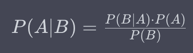
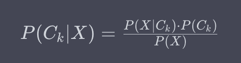

# Approcci generativi

### Indice degli argomenti

* [Approcci generativi](#approcci-generativi)
    * [Indice degli argomenti](#indice-degli-argomenti)
    * [Text classification](#text-classification)
        * [Tipi di text classification](#tipi-di-text-classification)
        * [Text classification: diversi approcci](#text-classification-diversi-approcci)
    * [Sentiment analysis](#sentiment-analysis)
        * [Dati di addestramento](#dati-di-addestramento)
        * [Sentiment dictionary](#sentiment-dictionary)
    * [Approcci generativi vs. discriminativi](#approcci-generativi-vs-discriminativi)
    * [Text classification diviso in due parti](#text-classification-diviso-in-due-parti)
        * [Rappresentazione dei dati](#rappresentazione-dei-dati)
            * [Bag of Words](#bag-of-words)
        * [Classificazione](#classificazione)
    * [Naïve Bayes](#naïve-bayes)
        * [Teorema di Bayes](#teorema-di-bayes)
        * [Bayes su BoW](#bayes-su-bow)
        * [Independence assumption](#independence-assumption)
        * [Classificatore "Maximum Likelihood"](#classificatore-maximum-likelihood)
        * [Migliore stima con Bayes](#migliore-stima-con-bayes)
            * [Probabilità a priori (prior)](#probabilità-a-priori-prior)
    * [Smoothing](#smoothing)
        * [Tecniche di smoothing](#tecniche-di-smoothing)

---

## Text classification

[~ Vai all'indice](#indice-degli-argomenti)

La text classification (classificazione del testo) è una delle attività fondamentali nel campo del Natural Language
Processing (NLP). Consiste nel processo di assegnare automaticamente una o più categorie o etichette predefinite a un
documento di testo in base al suo contenuto. Questa attività è spesso utilizzata per scopi diversi, come
l'organizzazione di documenti, la categorizzazione di messaggi, la rilevazione di spam, l'analisi del sentiment (
sentiment analysis), la classificazione dei documenti legali, e molto altro.

Ecco come funziona in modo generale il processo di text classification:

1. **Raccolta dei dati**: Innanzitutto, è necessario raccogliere un insieme di dati di addestramento che contengono
   esempi di documenti di testo etichettati con le categorie di interesse. Questo dataset viene utilizzato per
   addestrare un modello di classificazione.

2. **Pre-elaborazione dei testi**: I testi vengono preprocessati per rimuovere informazioni non rilevanti o rumore, come
   punteggiatura, parole comuni (stop words), e caratteri speciali. Inoltre, spesso vengono applicate tecniche di
   normalizzazione, come la lemmatizzazione o la stemmatizzazione, per ridurre le parole a forme di base.

3. **Creazione di features**: I testi devono essere rappresentati in un formato che possa essere utilizzato da un
   modello di machine learning. Questo coinvolge la creazione di features o vettori di attributi a partire dai testi.
   Queste features possono essere rappresentazioni one-hot encoding, TF-IDF (Term Frequency-Inverse Document Frequency),
   o embedding word come Word2Vec o GloVe.

4. **Addestramento del modello**: Un modello di machine learning, spesso un classificatore come Naïve Bayes, Support
   Vector Machine (SVM), o reti neurali come le reti neurali convoluzionali (CNN) o le reti neurali ricorrenti (RNN),
   viene addestrato utilizzando il dataset di addestramento e le features create. Il modello impara a distinguere tra le
   diverse categorie basandosi sulle features dei testi.

5. **Valutazione del modello**: Il modello addestrato viene valutato su un dataset di test separato per misurare le sue
   prestazioni. Questa valutazione può includere metriche come l'accuratezza, la precisione, il richiamo e l'F1-score.

6. **Predizione su nuovi testi**: Una volta che il modello è addestrato e valutato con successo, può essere utilizzato
   per classificare nuovi documenti di testo in base alle categorie desiderate.

7. **Ottimizzazione e aggiornamenti**: Spesso, è necessario ottimizzare il modello e mantenerlo aggiornato con nuovi
   dati per mantenerne le prestazioni nel tempo.

La text classification è una tecnica fondamentale in NLP ed è alla base di molte applicazioni, dal filtraggio di spam
all'analisi delle opinioni sui social media, dalla categorizzazione di documenti all'automazione del supporto clienti.

### Tipi di text classification

Esistono diversi tipi di text classification, a seconda degli obiettivi specifici dell'applicazione e delle categorie di
classificazione coinvolte. Ecco alcuni dei tipi più comuni di text classification:

1. **Classificazione binaria**: In questo caso, il testo viene assegnato a una delle due categorie possibili. Ad
   esempio, può essere utilizzata per il rilevamento di spam (spam vs. non spam), la classificazione di recensioni come
   positive o negative, o la rilevazione di messaggi come sicuri o sospetti.

2. **Classificazione multi-classe**: In questo tipo di classificazione, il testo viene assegnato a una delle molte
   categorie possibili. Ad esempio, si potrebbe classificare un articolo di notizie in una delle seguenti categorie:
   politica, sport, tecnologia o intrattenimento.

3. **Classificazione multi-etichetta**: Questa classificazione permette a un documento di testo di essere assegnato a
   più categorie contemporaneamente. Ad esempio, una recensione di un prodotto potrebbe essere etichettata come "
   positiva", "neutra" e "relativa alla durata della batteria" allo stesso tempo.

4. **Classificazione gerarchica**: Qui, le categorie di classificazione sono organizzate in una struttura gerarchica,
   consentendo la classificazione a livelli più alti e più bassi. Ad esempio, si potrebbe avere una gerarchia di
   categorie per classificare notizie in categorie più generali come "notizie politiche" o "notizie sportive", con
   categorie più specifiche sotto di esse.

5. **Classificazione di sequenze**: Questo tipo di classificazione si concentra sulla classificazione di sequenze di
   parole o token all'interno di un documento di testo. Ad esempio, si può utilizzare per l'identificazione di entità
   nominate (Named Entity Recognition) o per la segmentazione di frasi in discorsi.

6. **Classificazione del sentiment**: Questa è una forma specifica di text classification che mira a determinare il
   sentimento espresso in un testo, come positivo, neutro o negativo. È spesso utilizzata per analizzare le opinioni dei
   clienti sui prodotti o per monitorare il sentiment sui social media.

7. **Classificazione basata su conoscenza**: In questo tipo di classificazione, si utilizzano conoscenze specifiche del
   dominio per guidare la classificazione. Ad esempio, si potrebbe utilizzare un ontologia per classificare documenti in
   base ai concetti contenuti al loro interno.

8. **Classificazione tematica**: Questo tipo di classificazione è utilizzato per categorizzare i documenti in base a
   argomenti specifici o aree di interesse. Ad esempio, si può classificare una collezione di documenti di ricerca in
   base alle aree di ricerca a cui appartengono.

Questi sono solo alcuni esempi dei tipi di text classification che è possibile incontrare nell'ambito del Natural
Language Processing. La scelta del tipo di classificazione dipende dalle esigenze specifiche dell'applicazione e dalla
struttura dei dati a disposizione.

### Text classification: diversi approcci

Ci sono diversi approcci di text classification che possono essere utilizzati per addestrare modelli di machine learning
per classificare testi. Ecco alcuni degli approcci più comuni:

1. **Approccio basato su regole**: Questo approccio coinvolge la creazione di regole manuali o euristiche per
   classificare i testi. Ad esempio, potresti definire regole basate su parole chiave o espressioni regolari per
   identificare determinati tipi di testo. Tuttavia, questo approccio può essere limitato e richiedere molto lavoro
   manuale.

2. **Approccio basato su statistiche**: Questo approccio utilizza metodi statistici per la classificazione del testo. Ad
   esempio, il classificatore Bayesiano ingenuo (Naïve Bayes) è un approccio statistico comune. Utilizza la probabilità
   condizionata per assegnare un testo a una categoria in base alla frequenza delle parole nelle categorie di
   addestramento.

3. **Approccio basato su machine learning**: Questo è uno degli approcci più diffusi ed efficaci per la text
   classification. Coinvolge l'addestramento di modelli di machine learning, come Support Vector Machines (SVM), alberi
   decisionali, reti neurali, e altro ancora, utilizzando un dataset di addestramento etichettato. Questi modelli
   apprendono autonomamente i pattern nei dati per effettuare la classificazione.

4. **Approccio basato su deep learning**: Questo approccio utilizza reti neurali profonde (deep neural networks) per la
   text classification. Le reti neurali profonde possono catturare rappresentazioni complesse dei dati e sono
   particolarmente efficaci quando si tratta di dati non strutturati come il testo. Le reti neurali ricorrenti (RNN) e
   le reti neurali convoluzionali (CNN) sono spesso utilizzate per questo scopo.

5. **Approccio basato su trasferimento di apprendimento**: In questo approccio, si utilizzano modelli preaddestrati su
   grandi dataset, come BERT o GPT, e si effettua il fine-tuning su un dataset specifico per la text classification.
   Questo consente di sfruttare la conoscenza preesistente appresa dai modelli su vasti dataset, migliorando le
   prestazioni su compiti specifici.

6. **Approccio basato su feature engineering**: Questo approccio coinvolge l'ingegnerizzazione delle features utilizzate
   per rappresentare il testo in input. Le features possono includere rappresentazioni TF-IDF, word embeddings, o altre
   rappresentazioni personalizzate. L'ingegneria delle features può essere cruciale per ottenere buone prestazioni.

7. **Approccio basato su ensemble**: Gli ensemble combinano diversi modelli di classificazione per ottenere una
   previsione migliore rispetto a ciascun modello singolo. Ad esempio, si possono combinare diversi classificatori Naïve
   Bayes o modelli di machine learning tramite voto a maggioranza o altri metodi.

La scelta dell'approccio dipende spesso dalla complessità del problema, dalla quantità di dati disponibili, dalla
qualità dei dati e dalle risorse computazionali a disposizione. In molti casi, è consigliabile sperimentare con diversi
approcci e modelli per determinare quale funziona meglio per un dato compito di text classification.

---

## Sentiment analysis

[~ Vai all'indice](#indice-degli-argomenti)

La sentiment analysis, conosciuta anche come analisi del sentiment o analisi delle opinioni, è una delle applicazioni
più comuni e importanti del Natural Language Processing (NLP). Si tratta di una tecnica che mira a determinare il
sentiment o il tono emotivo espresso in un testo scritto, come una recensione, un tweet, un articolo o qualsiasi altro
tipo di documento di testo. In particolare, la sentiment analysis cerca di classificare il testo in una delle seguenti
categorie:

1. **Positivo**: Il testo esprime un sentimento positivo o una valutazione favorevole.

2. **Negativo**: Il testo esprime un sentimento negativo o una valutazione sfavorevole.

3. **Neutro**: Il testo non esprime un sentimento positivo o negativo in modo predominante ed è considerato neutro.

L'obiettivo principale della sentiment analysis è estrarre informazioni sul sentiment dai testi in modo automatico,
consentendo alle aziende e agli analisti di monitorare e comprendere meglio l'opinione pubblica, i feedback dei clienti
e l'atteggiamento degli utenti su prodotti, servizi, eventi o argomenti specifici.

Ecco alcune delle applicazioni comuni della sentiment analysis:

1. **Valutazione dei prodotti e dei servizi**: Le aziende utilizzano la sentiment analysis per monitorare le recensioni
   dei clienti online e per comprendere come i clienti percepiscono i loro prodotti o servizi.

2. **Gestione della reputazione online**: Le aziende e le persone pubbliche utilizzano la sentiment analysis per tenere
   traccia delle menzioni online e per gestire la loro reputazione online rispondendo a commenti negativi o promuovendo
   i commenti positivi.

3. **Analisi dei social media**: Le piattaforme di social media utilizzano la sentiment analysis per misurare l'umore e
   l'atteggiamento degli utenti rispetto a eventi attuali o discussioni online.

4. **Ricerca di mercato**: Le aziende utilizzano la sentiment analysis per ottenere informazioni di mercato, come
   l'opinione dei consumatori su nuovi prodotti o tendenze del settore.

5. **Monitoraggio delle notizie**: Le organizzazioni di stampa e di notizie utilizzano la sentiment analysis per
   identificare il tono delle notizie e per monitorare le reazioni del pubblico.

6. **Assistenza clienti**: Le aziende utilizzano la sentiment analysis per automatizzare il monitoraggio delle richieste
   e dei feedback dei clienti sui canali di assistenza clienti online.

Per eseguire la sentiment analysis, vengono utilizzati modelli di machine learning, in particolare reti neurali,
addestrati su grandi dataset etichettati con sentiment. Questi modelli imparano a riconoscere i pattern nei testi che
indicano il sentiment e sono in grado di classificare nuovi testi in base alle categorie di sentiment desiderate.

### Dati di addestramento

Di seguito ti mostro un esempio di dati di addestramento per il task di sentiment analysis, dove ogni riga rappresenta
un esempio di testo associato a una classe di sentiment (positivo, negativo o neutro). Questi dati di addestramento sono
spesso utilizzati per addestrare modelli di machine learning per eseguire la sentiment analysis:

```
Testo                                                       Sentimento
----------------------------------------------------------  ----------
Questo film è fantastico!                                   Positivo
Ho adorato la cena al ristorante ieri sera.                 Positivo
Il mio computer si è bloccato di nuovo.                     Negativo
Non mi è piaciuto per niente il servizio in quel negozio.   Negativo
È una giornata nuvolosa.                                    Neutro
Il nuovo album della band è uscito oggi.                    Neutro
```

In questo esempio:

- Le colonne "Testo" contengono i testi di esempio.
- La colonna "Sentimento" contiene le etichette di sentiment associate a ciascun testo. Le etichette possono essere "
  Positivo" quando il testo esprime un sentiment positivo, "Negativo" quando il testo esprime un sentiment negativo e "
  Neutro" quando il testo è neutro dal punto di vista del sentiment.

Questo è solo un piccolo set di dati di addestramento di esempio. In pratica, i dataset di addestramento per la
sentiment analysis sono spesso molto più grandi e contengono migliaia o milioni di esempi, coprendo una vasta gamma di
testi e sentiment diversi. L'addestramento di un modello di sentiment analysis su un ampio e diversificato dataset è
essenziale per ottenere buone prestazioni nella classificazione del sentiment in testi reali.

### Sentiment dictionary

I sentiment dictionary, noti anche come dizionari di sentiment o lessici di sentiment, sono insiemi di parole o frasi
associate a valori di sentiment predefiniti o etichette di polarità, che possono essere positivi, negativi o neutri.
Questi dizionari sono strumenti utilizzati nella sentiment analysis per assegnare valutazioni di sentiment ai testi in
base alle parole o frasi presenti all'interno di essi.

Ecco come funzionano i sentiment dictionary:

1. **Assegnazione di valori di sentiment**: Ogni parola o frase nel dizionario è associata a un valore di sentiment, che
   può essere una scala numerica, una etichetta di polarità (positivo, negativo, neutro) o un punteggio di sentiment. Ad
   esempio, la parola "felice" potrebbe essere associata al valore di sentiment "+1" o all'etichetta "positivo", mentre
   la parola "triste" potrebbe essere associata a "-1" o "negativo".

2. **Analisi del testo**: Quando si desidera valutare il sentiment di un testo, il dizionario di sentiment viene
   utilizzato per cercare le parole o frasi contenute nel testo. Ogni parola o frase corrispondente nel dizionario
   contribuisce al calcolo complessivo del sentiment del testo.

3. **Calcolo del punteggio di sentiment**: Una volta identificate le parole o frasi corrispondenti, si calcola un
   punteggio di sentiment complessivo sommando i valori di sentiment associati a ciascuna parola o frase nel testo. Il
   punteggio risultante può indicare se il testo è positivo, negativo o neutro.

4. **Classificazione del sentiment**: In base al punteggio di sentiment calcolato, il testo può essere classificato in
   una delle categorie di sentiment (positivo, negativo o neutro) o ricevere un punteggio numerico che rappresenta il
   grado di sentiment espresso nel testo.

5. **Utilizzo nella sentiment analysis**: I sentiment dictionary possono essere utilizzati come uno dei metodi per
   valutare il sentiment dei testi. Tuttavia, spesso vengono combinati con altri metodi più avanzati, come l'uso di
   modelli di machine learning, per ottenere previsioni più accurate e contestuali.

Un esempio di un dizionario di sentiment è il "Sentiment140" dictionary, che assegna valori di sentiment alle parole e
frasi in base alle loro connotazioni emotive. Questi dizionari sono utili quando si vuole una soluzione rapida per la
sentiment analysis o quando si lavora con testi in lingue diverse per cui non sono disponibili modelli di machine
learning preaddestrati.

Tuttavia, va notato che l'efficacia dei sentiment dictionary può variare notevolmente a seconda della lingua, del
contesto e della complessità del testo, e possono non essere sufficientemente accurati per alcune applicazioni di
sentiment analysis più sofisticate. Pertanto, l'uso di modelli di machine learning avanzati rimane una scelta preferita
per molte applicazioni di sentiment analysis.

---

## Approcci generativi vs. discriminativi

[~ Vai all'indice](#indice-degli-argomenti)

Ecco le differenze tra gli approcci generativi e discriminativi nella text classification:

| Caratteristica           | Approccio Generativo                                                                                                    | Approccio Discriminativo                                                                                 |
|--------------------------|-------------------------------------------------------------------------------------------------------------------------|----------------------------------------------------------------------------------------------------------|
| **Obiettivo principale** | Modellare la distribuzione congiunta P(input, classe)                                                                   | Modellare la probabilità condizionata P(classe \| input)                                                 |
| **Modello**              | Addestramento di modelli che generano sia input che classi                                                              | Addestramento di modelli che mappano direttamente input alle classi                                      |
| **Output**               | Possibilità di generare nuovi esempi di input appartenenti a una classe specifica                                       | Generano direttamente una previsione o una classe per un dato input                                      |
| **Uso tipico**           | Utilizzato quando si desidera generare nuovi esempi di input o campionare da una distribuzione di probabilità congiunta | Utilizzato quando l'obiettivo principale è la classificazione senza la necessità di generare nuovi input |

---

## Text classification diviso in due parti

[~ Vai all'indice](#indice-degli-argomenti)

Possiamo suddividere il processo di text classification in due fasi principali: la rappresentazione dei dati e la
classificazione.

### Rappresentazione dei dati

Questa fase coinvolge la trasformazione dei documenti di testo in una forma che possa essere utilizzata come input per
un modello di classificazione. Ecco alcune delle tecniche comuni di rappresentazione dei dati:

1. **One-Hot Encoding**: In questa tecnica, ogni parola o token nel documento viene rappresentato come un vettore
   binario con un valore "1" nella posizione corrispondente alla parola e "0" in tutte le altre posizioni. Questa
   rappresentazione è sparsa e può essere utilizzata per costruire un vettore di features per il documento.

2. **TF-IDF (Term Frequency-Inverse Document Frequency)**: Questa tecnica assegna un peso a ciascun termine in base alla
   sua frequenza nel documento (TF) e alla sua rarità nell'intero corpus di documenti (IDF). I documenti sono
   rappresentati come vettori di TF-IDF, che riflettono l'importanza dei termini nel contesto del documento e dell'
   intero corpus.

3. **Word Embeddings**: Questa tecnica rappresenta le parole come vettori densi in uno spazio continuo in modo che
   parole simili siano vicine tra loro in questo spazio. Popolari algoritmi di word embedding includono Word2Vec, GloVe
   e FastText. I documenti possono essere rappresentati come la media o la somma degli embeddings delle parole al loro
   interno;
4. **Bag of Words**.

#### Bag of Words

La rappresentazione BoW è una delle tecniche più semplici ma comuni utilizzate per convertire i documenti di testo in
vettori numerici utilizzabili dai modelli di machine learning.

Ecco come funziona la rappresentazione BoW:

1. **Creazione del vocabolario**: Innanzitutto, si crea un vocabolario unico a partire da tutti i termini (parole o
   token) nei documenti di addestramento. Ogni termine nel vocabolario ha un indice univoco associato.

2. **Creazione dei vettori**: Per ciascun documento di testo, si crea un vettore numerico con una dimensione uguale al
   numero di termini nel vocabolario. Inizialmente, tutti i valori del vettore sono impostati su zero.

3. **Conta delle occorrenze**: Per ogni termine nel documento, si incrementa il valore corrispondente nel vettore BoW in
   base al numero di volte che quel termine appare nel documento. Ad esempio, se la parola "gatto" appare tre volte nel
   documento, il valore corrispondente nel vettore BoW sarà impostato su 3.

4. **Rappresentazione sparsa**: Poiché la maggior parte dei documenti utilizza solo una piccola frazione del
   vocabolario, la rappresentazione BoW è sparsa, il che significa che la maggior parte dei valori nei vettori sono
   zeri. Questo consente di risparmiare spazio di memoria.

5. **Normalizzazione**: A volte, i vettori BoW possono essere normalizzati per tener conto della lunghezza dei documenti
   o per rimuovere effetti di scala. Una tecnica comune è la normalizzazione L2, che divide ciascun vettore per la sua
   norma Euclidea.

6. **Utilizzo nei modelli di machine learning**: I vettori BoW possono essere utilizzati come features di input per
   addestrare modelli di classificazione come Logistic Regression, Naïve Bayes, Support Vector Machines (SVM) o reti
   neurali.

La rappresentazione BoW è un modo semplice ed efficace per rappresentare documenti di testo, ma ha alcune limitazioni.
Non cattura l'ordine delle parole o le relazioni semantiche tra di esse, ed è sensibile alla frequenza dei termini (più
frequente è un termine, più influente sarà nel vettore BoW). Tuttavia, è un buon punto di partenza per molte
applicazioni di text classification e può essere utile in particolare quando si ha a che fare con dati di testo
strutturati in modo semplice.

### Classificazione

Una volta che i dati sono stati rappresentati in un formato adatto, viene eseguita la fase di classificazione, dove si
addestrano modelli per predire la classe o l'etichetta corrispondente a ciascun documento di testo. Ecco alcune delle
tecniche comuni di classificazione:

1. **Logistic Regression**: Questo è un modello lineare utilizzato per la classificazione binaria o multi-classe. Si
   basa sulla regressione logistica per stimare la probabilità che un documento appartenga a una classe specifica.

2. **Support Vector Machine (SVM)**: Questo è un modello di classificazione che cerca di trovare un iperpiano di
   separazione ottimale tra le classi. È ampiamente utilizzato per la classificazione binaria e multi-classe.

3. **Reti Neurali**: Le reti neurali, in particolare le reti neurali profonde, sono state utilizzate con successo per la
   classificazione del testo. Reti neurali ricorrenti (RNN) e reti neurali convoluzionali (CNN) sono comuni per il
   trattamento di dati di testo.

4. **Modelli di Trasformer**: Modelli come BERT, GPT e altri basati su architetture di trasformer sono diventati
   popolari per la text classification grazie alle loro prestazioni eccezionali. Possono essere utilizzati per il
   transfer learning e il fine-tuning su specifici compiti di classificazione.

La scelta della tecnica di rappresentazione dei dati e del modello di classificazione dipende dalle caratteristiche dei
dati e dagli obiettivi specifici del problema di text classification. Spesso è necessario sperimentare con diverse
tecniche per trovare quella più adatta a una determinata applicazione.

---

## Naïve Bayes

[~ Vai all'indice](#indice-degli-argomenti)

L'approccio Naïve Bayes è un algoritmo di classificazione basato sulla probabilità che può essere utilizzato
efficacemente in combinazione con la rappresentazione Bag of Words (BoW) per la text classification. Questo algoritmo si
basa sul teorema di Bayes e assume l'indipendenza condizionale tra le features, da cui il termine "naïve" nel suo nome.

### Teorema di Bayes

Certamente, il teorema di Bayes è una formula fondamentale nella teoria delle probabilità e della statistica, utilizzata
per calcolare la probabilità condizionata di un evento, data l'informazione su un altro evento correlato. Il teorema di
Bayes è spesso usato in contesti di inferenza statistica, machine learning e nell'analisi delle decisioni.

La formulazione generale del teorema di Bayes è la seguente:



Dove:

- P(A | B) è la probabilità condizionata di A dato B, cioè la probabilità che l'evento A si verifichi dato che l'
  evento B è noto.
- P(B | A) è la probabilità condizionata di B dato A, cioè la probabilità che l'evento B si verifichi dato che l'
  evento A è noto.
- P(A) è la probabilità marginale dell'evento A, cioè la probabilità che l'evento A si verifichi indipendentemente
  da B.
- P(B) è la probabilità marginale dell'evento B, cioè la probabilità che l'evento B si verifichi indipendentemente
  da A.

In termini più semplici, il teorema di Bayes permette di aggiornare le nostre credenze su un evento A, dato un nuovo
dato B. In altre parole, ci dice come la probabilità di A cambia in base a ciò che sappiamo riguardo a B.

Nel contesto dell'apprendimento automatico, il teorema di Bayes è spesso utilizzato per la classificazione e
l'apprendimento supervisionato, dove vogliamo calcolare la probabilità che un'istanza appartenga a una certa classe dati
gli attributi osservati. Un esempio di questo è il classificatore Naïve Bayes, che utilizza il teorema di Bayes per
calcolare la probabilità di appartenenza a una classe data l'osservazione di una caratteristica specifica.

In sintesi, il teorema di Bayes è una potente e flessibile formula che trova applicazioni in molti campi, incluso il
machine learning e l'analisi delle decisioni, dove è utilizzato per l'inferenza probabilistica.

### Bayes su BoW

Ecco come funziona l'approccio Naïve Bayes in relazione al BoW:

1. **Creazione dei dati di addestramento**:
    - Raccogli un dataset di addestramento contenente documenti di testo etichettati con le classi o le categorie
      desiderate (ad esempio, recensioni positive e negative).
    - Preprocessa i testi, rimuovendo stop words, punteggiatura e applicando altre tecniche di pulizia dei dati.

2. **Creazione del vocabolario BoW**:
    - Crea un vocabolario unico a partire dai termini presenti in tutti i documenti di addestramento.
    - Assegna un indice univoco a ciascun termine nel vocabolario.

3. **Creazione dei vettori BoW**:
    - Per ciascun documento di testo nei dati di addestramento, crea un vettore BoW.
    - Inizializza il vettore BoW con zeri per tutte le parole nel vocabolario.
    - Per ogni parola nel documento, incrementa il valore corrispondente nel vettore BoW in base al numero di volte che
      quella parola appare nel documento.

4. **Calcolo delle probabilità**:
    - Per ciascuna classe (ad esempio, classe positiva e classe negativa), calcola la probabilità a priori della classe,
      P(classe).
    - Per ciascun termine nel vocabolario, calcola la probabilità condizionata P(termine | classe) utilizzando i
      documenti di addestramento appartenenti a quella classe. Queste probabilità condizionate possono essere calcolate
      come il numero di volte che il termine appare nella classe diviso il numero totale di parole nella classe.

5. **Classificazione**:
    - Quando arriva un nuovo documento di testo, rappresentalo come un vettore BoW.
    - Utilizza il teorema di Bayes per calcolare la probabilità condizionata P(classe | documento) per ciascuna classe,
      utilizzando le probabilità calcolate in precedenza e le frequenze dei termini nel documento.
    - Assegna al documento la classe con la probabilità condizionata massima, cioè la classe con il punteggio più alto.

6. **Valutazione del modello**:
    - Valuta le prestazioni del modello utilizzando un dataset di test separato. Puoi utilizzare metriche come
      l'accuratezza, la precisione, il richiamo e l'F1-score per misurare le prestazioni del modello.

L'approccio Naïve Bayes è noto per la sua semplicità e velocità di addestramento, ed è particolarmente adatto per
dataset di testo di dimensioni moderate. Tuttavia, l'assunzione di indipendenza condizionale tra le features può non
essere sempre accurata nella pratica, e questo è il motivo per cui è chiamato "naïve". Nonostante ciò, è spesso
utilizzato come punto di riferimento nella text classification e può ottenere risultati sorprendentemente buoni,
soprattutto quando il dataset è ben bilanciato e contiene una quantità sufficiente di dati.

### Independence assumption

L'**assunzione di indipendenza** è una supposizione fondamentale in statistica e nel machine
learning, che indica che due o più variabili sono considerate indipendenti tra loro. Questa assunzione è spesso fatta
per semplificare i modelli e i calcoli, ma può non essere realistica in molti contesti reali.

Nell'ambito della text classification e dell'apprendimento automatico, l'assunzione di indipendenza può essere applicata
in vari modi, ad esempio:

1. **Naïve Bayes**: Nel classificatore Naïve Bayes, c'è un'assunzione di indipendenza tra le features (termini o
   attributi) utilizzate per la classificazione. Questo significa che si assume che la presenza di un termine nel
   documento sia indipendente dalla presenza di altri termini. Anche se questa assunzione è chiaramente semplificativa e
   spesso non rispecchia la realtà (poiché le parole nei documenti di testo sono spesso correlate), il classificatore
   Naïve Bayes può ancora funzionare sorprendentemente bene in molte applicazioni di text classification.

2. **Regressione Lineare**: Nella regressione lineare, si assume l'indipendenza tra le variabili indipendenti (features)
   utilizzate per prevedere la variabile dipendente (il target). Questo significa che si suppone che una variazione in
   una feature non abbia un effetto correlato su altre features. In molti casi, questa assunzione è inaccettabile, e
   modelli più complessi come la regressione logistica o le reti neurali possono essere utilizzati per gestire relazioni
   più complesse tra le features.

3. **Altre applicazioni**: L'assunzione di indipendenza può essere applicata in molte altre situazioni, a seconda del
   contesto specifico. Ad esempio, nell'analisi delle serie storiche, si potrebbe assumere l'indipendenza tra le
   osservazioni temporali, anche se in realtà possono esistere dipendenze temporali.

È importante notare che l'assunzione di indipendenza è spesso fatta per semplificare i modelli e i calcoli, ma può
essere una semplificazione eccessiva in molte situazioni. Nella pratica, è importante valutare attentamente se questa
assunzione è ragionevole per il problema specifico che si sta affrontando. In molti casi, i modelli più complessi che
tengono conto delle relazioni tra le variabili possono condurre a previsioni più accurate.

### Classificatore "Maximum Likelihood"

Un classificatore "maximum likelihood" (massima verosimiglianza) è un tipo di classificatore utilizzato
nell'apprendimento automatico e nella statistica per assegnare una classe o una categoria a un'istanza di input
basandosi sulla stima della probabilità che l'istanza appartenga a ciascuna classe. Questo tipo di classificatore si
basa sul principio della massima verosimiglianza.

Ecco come funziona un classificatore "maximum likelihood":

1. **Stima delle probabilità di classe**: Per addestrare il classificatore, vengono calcolate le probabilità
   condizionate delle classi date le istanze di input di addestramento. In altre parole, si calcola la probabilità che
   un'istanza appartenga a ciascuna classe.

2. **Massima Verosimiglianza**: Il classificatore attribuirà l'istanza alla classe che ha la massima probabilità
   condizionata data l'istanza. In termini matematici, questa classe è ottenuta utilizzando il principio della massima
   verosimiglianza, che significa scegliere la classe che massimizza la probabilità condizionata dei dati dati i
   parametri del modello.

3. **Stima dei parametri**: Per stimare le probabilità condizionate, il classificatore "maximum likelihood" utilizza i
   dati di addestramento per stimare i parametri del modello. Ad esempio, nel caso di un classificatore Naïve Bayes, si
   stimano le probabilità condizionate utilizzando la frequenza delle features (termini) nei documenti di addestramento
   appartenenti a ciascuna classe.

4. **Classificazione**: Una volta addestrato, il classificatore può essere utilizzato per classificare nuove istanze di
   input. Per ciascuna istanza, calcolerà la probabilità condizionata per ciascuna classe e assegnerà l'istanza alla
   classe con la massima probabilità.

Il classificatore "maximum likelihood" è spesso utilizzato con modelli di apprendimento automatico come il
classificatore Naïve Bayes, dove le probabilità condizionate vengono stimate in base alle frequenze dei termini nei
documenti di addestramento. Tuttavia, il concetto di massima verosimiglianza può essere applicato anche ad altri tipi di
modelli di classificazione, a seconda del contesto e dei dati disponibili.

In generale, l'obiettivo di un classificatore "maximum likelihood" è quello di attribuire una classe all'istanza di
input che è più probabile sulla base dei dati di addestramento e delle informazioni stimate dal modello.

### Migliore stima con Bayes

La stima migliore di classificazione di testo usando il teorema di Bayes è spesso associata al classificatore Naïve
Bayes. La formula chiave utilizzata in questo contesto è la seguente:



Dove:

- \(P(C_k | X)\) è la probabilità condizionata che un documento \(X\) appartenga alla classe \(C_k\) (classe di
  destinazione).
- \(P(X | C_k)\) è la probabilità condizionata del documento \(X\) dato che appartiene alla classe \(C_k\). Questa
  probabilità può essere stimata utilizzando il modello Naïve Bayes.
- \(P(C_k)\) è la probabilità a priori della classe \(C_k\), cioè la probabilità che un documento appartenga a \(C_k\)
  basandosi solo sulle informazioni delle classi.
- \(P(X)\) è la probabilità marginale del documento \(X\), cioè la probabilità che il documento \(X\) si verifichi
  indipendentemente dalla classe.

Nel contesto del classificatore Naïve Bayes per la text classification:

- \(P(C_k)\) è spesso stimata dalla frequenza delle classi nel set di addestramento. Ad esempio, se ci sono 100
  documenti positivi su un totale di 200 documenti, allora **P(C_k = {"positivo"}) = 100/200**.
- \(P(X | C_k)\) è stimata utilizzando l'assunzione "naïve" di indipendenza tra le features (parole o token) nei
  documenti, il che semplifica il calcolo. In questo caso, \(P(X | C_k)\) è calcolata come il prodotto delle probabilità
  delle singole parole dati \(C_k\). Queste probabilità delle parole possono essere stimata dalla frequenza delle parole
  nei documenti di addestramento appartenenti a \(C_k\).
- \(P(X)\) può essere ignorata nel calcolo poiché è lo stesso per tutte le classi e non influisce sulla decisione di
  classificazione.

La stima migliore dei parametri del modello Naïve Bayes come P(C_k) e P(X | C_k) dipende dai dati di
addestramento e dalle tecniche utilizzate per l'addestramento del modello. Una volta stimati questi parametri, il
modello può essere utilizzato per classificare nuovi documenti di testo calcolando P(C_k | X) per ogni classe
possibile e scegliendo la classe con la massima probabilità come previsione finale.

#### Probabilità a priori (prior)

Le probabilità a priori nel contesto del teorema di Bayes rappresentano le probabilità delle diverse ipotesi o classi
prima di avere osservato i dati o le evidenze. Queste probabilità a priori riflettono le credenze o le probabilità
iniziali che si hanno prima di ottenere informazioni aggiuntive dai dati.

Nel teorema di Bayes, la probabilità a priori è indicata come P(H), dove H rappresenta un'ipotesi o una classe
di interesse. Quindi, P(H) rappresenta la probabilità di H prima di qualsiasi osservazione o evidenza.

Nel contesto della classificazione di testo (come il classificatore Naïve Bayes per la text classification), le
probabilità a priori rappresentano la probabilità che un documento appartenga a una specifica classe di destinazione (ad
esempio, "positivo" o "negativo") prima di avere visto il documento stesso. Le probabilità a priori delle classi sono
spesso stimate utilizzando la frequenza delle classi nel set di addestramento. Ad esempio, se ci sono 100 documenti
positivi e 200 documenti totali nel set di addestramento, la probabilità a priori di una classe "positivo" sarebbe P(
{"positivo"}) = 100/200 = 0.5.

Le probabilità a priori svolgono un ruolo importante nel teorema di Bayes poiché vengono combinate con le probabilità
condizionate (come P(X | H), dove X rappresenta i dati osservati) per calcolare le probabilità a posteriori (
probabilità dell'ipotesi o classe data l'evidenza). Queste probabilità a posteriori sono ciò che il teorema di Bayes
cerca di stimare.

In sintesi, le probabilità a priori rappresentano le probabilità iniziali o le credenze sulle ipotesi o le classi prima
di ottenere informazioni aggiuntive dai dati osservati. Nel contesto della classificazione, queste probabilità a priori
possono influenzare le previsioni del modello di classificazione, ma vengono aggiornate utilizzando le evidenze dai dati
durante il processo di classificazione basato su Bayes.

---

## Smoothing

[~ Vai all'indice](#indice-degli-argomenti)

Lo smoothing, noto anche come regolarizzazione o additività, è una tecnica utilizzata nell'apprendimento automatico,
nella statistica e nella probabilità per mitigare problemi derivanti da dati con frequenze basse o da modelli troppo
complessi. L'obiettivo principale dello smoothing è quello di rendere i modelli più robusti e generalizzabili, evitando
l'overfitting (sovrapprendimento) e migliorando le prestazioni su dati di test.

Ecco perché si applica lo smoothing:

1. **Affrontare Frequenze Basse**: Lo smoothing è spesso utilizzato quando si hanno dati con frequenze basse o quando si
   sta lavorando con campioni limitati. In tali casi, le stime delle probabilità o delle frequenze basate solo sui dati
   di addestramento possono essere instabili o dare risultati non rappresentativi della distribuzione reale dei dati.

2. **Evitare Overfitting**: Lo smoothing può aiutare a evitare l'overfitting, che si verifica quando un modello è troppo
   complesso e si adatta eccessivamente ai dati di addestramento, perdendo la capacità di generalizzare bene su nuovi
   dati di test. Aggiungendo un po' di regolarizzazione tramite lo smoothing, il modello può diventare meno sensibile ai
   dettagli del training set e più robusto nei confronti di dati non visti.

3. **Migliorare le Prestazioni**: In alcune situazioni, lo smoothing può migliorare le prestazioni del modello, in
   particolare quando il modello ha una complessità elevata. Può contribuire a rendere le previsioni più stabili e meno
   sensibili a piccole variazioni nei dati.

4. **Gestire Model Selection**: Nella selezione del modello, lo smoothing può essere utilizzato per trovare un
   equilibrio tra modelli troppo complessi e modelli troppo semplici. Può aiutare a scegliere un modello che sia più
   adatto ai dati disponibili e all'applicazione specifica.

Ci sono diverse tecniche di smoothing utilizzate in diversi contesti. Un esempio comune di smoothing è il Laplace
smoothing (noto anche come add-one smoothing), che consiste nell'aggiungere una piccola quantità (1) a ciascuna
frequenza dei dati di addestramento prima di calcolare le probabilità condizionate. Questo assicura che anche le
categorie o i termini con frequenze basse abbiano probabilità non nulle. Altre tecniche di smoothing includono lo
smoothing di Lidstone e lo smoothing di Good-Turing, che introducono una maggiore flessibilità nei parametri di
smoothing.

In sintesi, lo smoothing è una pratica importante nell'apprendimento automatico e nella statistica per migliorare la
robustezza e le prestazioni dei modelli, specialmente quando si lavora con dati limitati o complessi.

### Tecniche di smoothing

Esistono diverse tecniche di smoothing utilizzate in varie applicazioni, che vengono applicate per mitigare problemi
legati a dati con frequenze basse o per regolarizzare modelli troppo complessi. Ecco alcune delle tecniche di smoothing
più comuni:

1. **Laplace Smoothing (Add-One Smoothing)**:
    - Aggiunge una piccola quantità (di solito 1) a ciascuna frequenza nel conteggio dei dati di addestramento.
    - Assicura che anche le categorie o i termini con frequenze basse abbiano probabilità non nulle.
    - È spesso utilizzato nella stima delle probabilità in modelli come il classificatore Naïve Bayes.

2. **Lidstone Smoothing (Additive Smoothing)**:
    - È una generalizzazione del Laplace smoothing, dove viene aggiunto un parametro di smoothing \(\alpha\) invece che
      un valore fisso come 1.
    - \(\alpha\) controlla la quantità di smoothing applicata, con \(\alpha = 1\) che equivale al Laplace smoothing.

3. **Good-Turing Smoothing**:
    - Si basa su un'analisi statistica delle frequenze dei dati di addestramento per stimare le probabilità delle
      categorie con frequenze basse.
    - Le categorie con frequenze non viste nei dati di addestramento ricevono una stima di probabilità basata su una
      regola di regolarizzazione.

4. **Kneser-Ney Smoothing**:
    - È spesso utilizzato nelle applicazioni di modellazione del linguaggio e nella stima delle probabilità delle parole
      in un contesto.
    - Si basa su un modello di probabilità di n-grammi e utilizza tecniche complesse per stimare le probabilità delle
      parole.

5. **Interpolated Smoothing**:
    - Combina le probabilità stimare da più modelli di lingua o fonti di informazione.
    - Si assegna un peso a ciascun modello e si interpola le probabilità stimare da questi modelli per ottenere una
      stima finale della probabilità.

6. **Backoff Smoothing**:
    - Si basa su modelli di lingua più complessi e, quando questi modelli non hanno informazioni sufficienti per una
      determinata sequenza di parole, "backoff" a modelli più semplici o più generali.
    - Questa tecnica permette di gestire sequenze di parole meno frequenti.

7. **Discounting**:
    - Riduce le frequenze delle parole nei dati di addestramento per stimare le probabilità delle parole meno frequenti.
    - Può essere utilizzato in combinazione con altre tecniche di smoothing.

Le tecniche di smoothing vengono utilizzate in una varietà di contesti, inclusi modelli di lingua, classificatori di
testo, stime di probabilità condizionate e altro ancora. La scelta della tecnica di smoothing dipende spesso dal tipo di
dati, dal modello e dagli obiettivi specifici dell'applicazione.