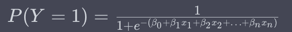
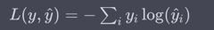

# Approcci discriminativi

### Indice degli argomenti

* [Approcci discriminativi](#approcci-discriminativi)
    * [Indice degli argomenti](#indice-degli-argomenti)
    * [Approcci discriminativi](#approcci-discriminativi-1)
    * [Logistic regression](#logistic-regression)
    * [Feature representation](#feature-representation)
    * [Loss function](#loss-function)
        * [Funzione obiettivo](#funzione-obiettivo)
        * [Funzione di attivazione](#funzione-di-attivazione)
    * [Conditional Maximum Likelihood Estimation](#conditional-maximum-likelihood-estimation)
    * [Cross-entropy Loss](#cross-entropy-loss)
    * [Gradient Descent](#gradient-descent)
        * [Stochastic Gradient Descent](#stochastic-gradient-descent)
    * [Overfitting](#overfitting)
        * [Regularization (regolarizzazione)](#regularization-regolarizzazione)

---

## Approcci discriminativi

[~ Vai all'indice](#indice-degli-argomenti)

Gli approcci discriminativi nell'ambito della text classification si concentrano sulla modellazione diretta della
relazione tra le features (ad esempio, le parole nei documenti di testo) e le classi di destinazione. Questi approcci
mirano a trovare una funzione o un modello che possa distinguere in modo efficace le diverse classi basandosi sulle
caratteristiche estratte dai dati di addestramento.

Ecco come funzionano gli approcci discriminativi:

1. **Rappresentazione dei dati**: Iniziano con la rappresentazione dei dati, dove i documenti di testo vengono
   trasformati in vettori numerici. Questa rappresentazione può essere realizzata utilizzando tecniche come il Bag of
   Words (BoW), il TF-IDF (Term Frequency-Inverse Document Frequency), o rappresentazioni più avanzate come gli word
   embeddings (ad esempio, Word2Vec o GloVe).

2. **Selezione delle features**: In alcuni casi, si può effettuare una selezione delle features per ridurre la
   dimensionalità dei dati o per includere solo le informazioni più rilevanti.

3. **Modello discriminativo**: Gli approcci discriminativi utilizzano un modello matematico per apprendere la relazione
   tra le features (la rappresentazione dei dati) e le classi di destinazione. Alcuni dei modelli più comuni utilizzati
   includono:
    - **Regressione Logistica**: Questo modello è ampiamente utilizzato per la classificazione binaria e multiclasse.
      Modella la probabilità che un'istanza appartenga a una classe specifica.
    - **Support Vector Machine (SVM)**: Le SVM cercano di trovare un iperpiano che separi le diverse classi nello spazio
      delle features in modo ottimale.
    - **Reti Neurali**: Le reti neurali, in particolare le reti neurali profonde, sono in grado di apprendere
      rappresentazioni complesse dei dati e sono utilizzate in molte applicazioni di text classification.
    - **Altri modelli di apprendimento automatico**: Ci sono molte altre tecniche e algoritmi utilizzati in base al
      contesto specifico e ai requisiti dell'applicazione.

4. **Addestramento del modello**: Il modello discriminativo viene addestrato utilizzando un set di addestramento
   contenente documenti di testo etichettati con le classi di destinazione. Il modello cerca di adattarsi ai dati di
   addestramento in modo da massimizzare la capacità di separazione tra le diverse classi.

5. **Validazione e test**: Il modello addestrato viene validato e testato su set di dati separati per valutare le sue
   prestazioni. Le metriche di valutazione comuni includono l'accuratezza, la precisione, il richiamo, l'F1-score e
   altre metriche specifiche del problema.

6. **Predizione**: Una volta addestrato, il modello può essere utilizzato per classificare nuovi documenti di testo,
   stimando la classe di destinazione in base alle features estratte dai dati.

Gli approcci discriminativi sono ampiamente utilizzati nella text classification perché possono modellare relazioni
complesse tra le features e le classi di destinazione. Tuttavia, possono richiedere un ampio set di dati di
addestramento per funzionare efficacemente e sono sensibili alla qualità della rappresentazione dei dati. La scelta del
modello discriminativo dipende spesso dalla complessità del problema e dai dati disponibili.

---

## Logistic regression

[~ Vai all'indice](#indice-degli-argomenti)

La regressione logistica è un modello statistico utilizzato principalmente per la classificazione binaria, cioè per
prevedere una delle due classi possibili (solitamente etichettate come 0 e 1) in base a una serie di variabili
indipendenti o features. Nonostante il nome, la regressione logistica è utilizzata per problemi di classificazione, non
di regressione.

Ecco come funziona la regressione logistica:

1. **Rappresentazione dei dati**: Inizia con un set di dati di addestramento che contiene coppie di input e output, dove
   gli input sono le variabili indipendenti o features e gli output sono le etichette di classe (0 o 1) che si desidera
   prevedere.

2. **Creazione della funzione logistica**: La regressione logistica utilizza una funzione logistica (o sigmoide) per
   mappare una combinazione lineare delle features in un valore tra 0 e 1, che rappresenta la probabilità di
   appartenenza alla classe positiva (classe 1). La funzione logistica è definita come segue:

   

    - \(P(Y=1)\) rappresenta la probabilità che l'istanza appartenga alla classe 1.
    - \(B_0, B_1, B_2, ..., B_n\) sono i coefficienti del modello, che vengono appresi durante
      l'addestramento.
    - \(x_1, x_2, ..., x_n\) sono le features dell'istanza di input.

3. **Addestramento del modello**: L'obiettivo dell'addestramento è trovare i migliori valori dei coefficienti \(B\)
   in modo che il modello si adatti bene ai dati di addestramento. Questo viene fatto massimizzando la likelihood
   function o minimizzando la devianza.

4. **Valutazione del modello**: Una volta addestrato il modello, viene valutato sul set di dati di test o su dati non
   visti per determinare le sue prestazioni. Le metriche comuni di valutazione includono l'accuratezza, la precisione,
   il richiamo, l'F1-score e l'area sotto la curva ROC (AUC-ROC).

5. **Predizione**: Il modello addestrato può quindi essere utilizzato per effettuare previsioni su nuovi dati di input.
   Si calcola la probabilità prevista di appartenenza alla classe positiva utilizzando la funzione logistica, e se
   questa probabilità supera una soglia di decisione (tipicamente 0.5), l'istanza viene classificata come appartenente
   alla classe 1; altrimenti, viene classificata come appartenente alla classe 0.

La regressione logistica è un modello lineare generalizzato che è semplice da implementare, interpretare e
regolarizzare. Può essere esteso alla classificazione multiclasse (non solo binaria) utilizzando tecniche come la "
One-vs-Rest" o la "Softmax Regression". È ampiamente utilizzato in vari campi, tra cui medicina, biologia, marketing e
scienze sociali, per risolvere problemi di classificazione binaria e multiclasse.

---

## Feature representation

[~ Vai all'indice](#indice-degli-argomenti)

La "feature representation" (rappresentazione delle features) è una rappresentazione numerica o vettoriale delle
caratteristiche (features) di un oggetto, un documento o un'osservazione, che consente di rappresentare tali
caratteristiche in modo che possano essere utilizzate da algoritmi di machine learning o analisi statistica. La feature
representation è fondamentale in molti ambiti dell'apprendimento automatico e dell'analisi dei dati, inclusa la text
classification, la visione artificiale, il riconoscimento vocale e molti altri.

Ecco alcune informazioni chiave sulla feature representation:

1. **Conversione delle Caratteristiche in Numeri**: Spesso, le caratteristiche iniziali sono non numeriche, come testo,
   immagini o suoni. La feature representation è il processo di trasformazione di queste caratteristiche in numeri o
   vettori numerici che possono essere elaborati da algoritmi di machine learning.

2. **Rappresentazione Vettoriale**: La rappresentazione delle features è comunemente espressa in forma di vettori
   numerici, dove ogni elemento del vettore rappresenta una specifica caratteristica o attributo dell'oggetto o dell'
   osservazione. Ad esempio, in un problema di text classification, ogni parola in un documento può essere rappresentata
   da un valore numerico che indica la sua frequenza o importanza nel documento.

3. **Importanza della Rappresentazione**: La qualità della feature representation è cruciale per le prestazioni di un
   modello di machine learning. Una buona rappresentazione dovrebbe catturare le informazioni rilevanti e discriminanti
   delle caratteristiche, consentendo al modello di fare previsioni accurate.

4. **Riduzione della Dimensionalità**: In molti casi, il numero di caratteristiche può essere molto elevato. La
   riduzione della dimensionalità è il processo di selezione delle feature più informative o di estrazione di feature
   ridotte che conservino la maggior parte delle informazioni rilevanti, riducendo così il carico computazionale e il
   rischio di overfitting.

5. **Metodi di Rappresentazione**: Ci sono molte tecniche per la feature representation, a seconda del tipo di dati e
   del problema. Alcuni esempi includono la rappresentazione Bag of Words (BoW) per il testo, l'uso di word embeddings
   come Word2Vec o GloVe, la rappresentazione di immagini come vettori di pixel, e altro ancora.

6. **Applicazioni**: La feature representation è utilizzata in molte applicazioni, come il riconoscimento di immagini,
   la classificazione di testo, il riconoscimento vocale, la raccomandazione di prodotti e altre aree in cui è
   necessario trasformare le informazioni non numeriche in un formato adatto per l'analisi e la previsione
   automatizzate.

In sintesi, la feature representation è un passaggio fondamentale nel processo di preparazione dei dati per
l'apprendimento automatico e l'analisi dei dati. Una buona rappresentazione delle features può migliorare notevolmente
le prestazioni dei modelli di machine learning e consentire loro di sfruttare al meglio le informazioni presenti nei
dati.

---

## Loss function

[~ Vai all'indice](#indice-degli-argomenti)

La "loss function" (funzione di perdita) è una funzione matematica utilizzata nell'ambito del machine learning e dell'
ottimizzazione per misurare la discrepanza tra i valori previsti da un modello e i valori effettivi (o target) nei dati
di addestramento. La loss function è fondamentale per l'addestramento di modelli di machine learning, poiché fornisce
una misura di quanto bene il modello si sta comportando rispetto agli obiettivi desiderati e aiuta a guidare il processo
di ottimizzazione per migliorare le prestazioni del modello.

Ecco alcune caratteristiche chiave delle loss functions:

1. **Valutazione delle Prestazioni**: La loss function quantifica l'errore tra le previsioni del modello e i valori
   reali nei dati di addestramento. Una loss function restituirà un valore maggiore se le previsioni sono lontane dai
   target desiderati e un valore minore se le previsioni sono vicine ai target.

2. **Ottimizzazione**: L'obiettivo dell'addestramento di un modello di machine learning è quello di minimizzare la loss
   function, ovvero di ridurre al minimo l'errore tra le previsioni del modello e i dati di addestramento. Questo
   processo di minimizzazione della loss function è noto come "ottimizzazione".

3. **Scelta della Loss Function**: La scelta della loss function dipende dal tipo di problema di machine learning. Per
   esempio, in un problema di regressione (dove si cercano valori numerici), una loss function comune è la mean squared
   error (MSE), mentre in un problema di classificazione (dove si cercano classi discrete), la cross-entropy loss è
   spesso utilizzata.

4. **Funzione Obiettivo**: La loss function viene utilizzata come funzione obiettivo durante l'ottimizzazione. Gli
   algoritmi di ottimizzazione cercano i parametri del modello (come i pesi nelle reti neurali) che minimizzano questa
   funzione di perdita.

5. **Regolarizzazione**: Alcune loss functions incorporano termini di regolarizzazione per prevenire l'overfitting.
   Questi termini di regolarizzazione aiutano a controllare la complessità del modello durante l'addestramento.

6. **Valutazione del Modello**: Dopo l'addestramento, la loss function può essere utilizzata anche per valutare le
   prestazioni del modello su dati di test o dati di validazione. Un valore di loss basso indica una buona adattamento
   del modello ai dati di test.

Ecco alcune esempi di loss functions comuni:

- **Mean Squared Error (MSE)**: Utilizzato in problemi di regressione per misurare l'errore quadratico medio tra le
  previsioni del modello e i valori effettivi.

- **Cross-Entropy Loss**: Utilizzato in problemi di classificazione per misurare la discrepanza tra le probabilità
  previste dal modello e le etichette reali dei dati.

- **Hinge Loss**: Comunemente utilizzato in problemi di classificazione con Support Vector Machines (SVM) per promuovere
  una separazione chiara tra classi.

- **Log Loss (o Binary Cross-Entropy)**: Spesso utilizzato in problemi di classificazione binaria per misurare la
  discrepanza tra le probabilità previste e le etichette binarie.

La scelta della loss function giusta è cruciale per il successo del modello di machine learning, poiché influisce sul
comportamento dell'addestramento e sulla capacità del modello di adattarsi ai dati.

### Funzione obiettivo

La "funzione obiettivo" (o "funzione di costo" o "funzione di perdita") è una funzione matematica utilizzata nell'ambito
del machine learning e dell'ottimizzazione per quantificare quanto bene un modello si adatta ai dati di addestramento e
come tale funzione dovrebbe essere minimizzata o massimizzata durante il processo di addestramento.

Il significato principale della funzione obiettivo è quello di definire un obiettivo o una misura chiara e quantitativa
che il modello di machine learning deve cercare di ottimizzare durante l'addestramento. La scelta di una specifica
funzione obiettivo dipende dal tipo di problema di machine learning che si sta affrontando. Ecco alcuni esempi:

1. **Problemi di Regressione**: In un problema di regressione, dove l'obiettivo è prevedere un valore numerico (ad
   esempio, il prezzo di una casa), la funzione obiettivo può essere la "Mean Squared Error" (MSE) che misura la
   discrepanza media al quadrato tra le previsioni del modello e i valori effettivi.

2. **Problemi di Classificazione**: In un problema di classificazione, dove l'obiettivo è assegnare un'etichetta di
   classe a un'istanza (ad esempio, riconoscere se un'email è spam o non spam), la funzione obiettivo può essere la "
   Cross-Entropy Loss" o la "Hinge Loss" a seconda del tipo di classificazione.

3. **Problemi di Clustering**: In un problema di clustering, l'obiettivo è suddividere i dati in gruppi omogenei. La
   funzione obiettivo può essere basata sulla somma delle distanze tra i punti all'interno degli stessi gruppi (
   minimizzando la varianza intra-cluster) o sulla somma delle distanze tra i punti di gruppi diversi (massimizzando la
   separazione inter-cluster).

4. **Problemi di Riduzione della Dimensionalità**: In problemi come la PCA (Principal Component Analysis) o la t-SNE (
   t-distributed Stochastic Neighbor Embedding), l'obiettivo è ridurre la dimensionalità dei dati. La funzione obiettivo
   cerca di preservare determinate proprietà dei dati mentre li proietta in uno spazio di dimensioni inferiori.

La funzione obiettivo guida l'ottimizzazione del modello durante l'addestramento. L'obiettivo è trovare i parametri del
modello che minimizzano o massimizzano il valore della funzione obiettivo. Gli algoritmi di ottimizzazione, come la
discesa del gradiente, vengono utilizzati per aggiornare iterativamente i parametri del modello al fine di raggiungere
questo obiettivo.

In sintesi, la funzione obiettivo definisce ciò che un modello di machine learning deve cercare di ottimizzare durante
l'addestramento. È una parte fondamentale del processo di addestramento poiché guida l'adattamento del modello ai dati e
influenza direttamente le prestazioni del modello sui dati di test o in situazioni reali.

### Funzione di attivazione

La "funzione di attivazione" è una componente chiave delle reti neurali artificiali, utilizzata per introdurre la non
linearità nei neuroni artificiali di una rete neurale. Questa non linearità è fondamentale perché permette alle reti
neurali di apprendere relazioni complesse nei dati, rendendole in grado di svolgere compiti di apprendimento automatico,
come classificazione, regressione, elaborazione del linguaggio naturale e visione artificiale.

Ecco il significato e il ruolo della funzione di attivazione:

1. **Ruolo di Neuroni Artificiali**: In una rete neurale, i neuroni artificiali (o nodi) ricevono input dai neuroni
   nelle layer precedenti o dai dati di input. Questi input vengono combinati linearmente con pesi associati, ma
   l'output del neurone non è una semplice combinazione lineare degli input.

2. **Introduzione della Non Linearità**: La funzione di attivazione introduce la non linearità nella trasformazione
   dell'input del neurone in output. In altre parole, la funzione di attivazione determina se il neurone deve "
   attivarsi" o "rimanere inattivo" in base alle informazioni ricevute dagli input.

3. **Apprendimento di Relazioni Complesse**: Questa non linearità è essenziale per consentire alla rete neurale di
   apprendere relazioni complesse nei dati, poiché le relazioni reali spesso non sono lineari. Senza funzioni di
   attivazione, una rete neurale sarebbe in grado di rappresentare solo relazioni lineari tra le features.

4. **Diversi Tipi di Funzioni di Attivazione**: Esistono diverse funzioni di attivazione utilizzate in reti neurali, tra
   cui:
    - **Sigmoid**: La funzione sigmoid produce un output compreso tra 0 e 1. È spesso utilizzata nei neuroni di output
      per problemi di classificazione binaria.
    - **ReLU (Rectified Linear Unit)**: La funzione ReLU è una delle funzioni di attivazione più comuni. Restituisce
      l'input se è positivo e 0 altrimenti.
    - **Leaky ReLU**: Questa funzione è una variante di ReLU che permette un piccolo flusso di input negativo.
    - **Tanh (Tangente iperbolica)**: La funzione tanh è simile alla sigmoid ma produce output compresi tra -1 e 1. È
      spesso utilizzata nei neuroni nascosti di reti neurali.

5. **Selezione della Funzione di Attivazione**: La scelta della funzione di attivazione dipende dal problema che si sta
   affrontando. In molti casi, ReLU è una buona scelta di default e spesso funziona bene in reti neurali profonde.
   Tuttavia, in alcuni casi, è necessario eseguire esperimenti per determinare quale funzione di attivazione funziona
   meglio per un problema specifico.

In sintesi, la funzione di attivazione è un componente critico delle reti neurali che introduce non linearità e consente
alle reti di apprendere relazioni complesse nei dati. La scelta della funzione di attivazione influisce sul
comportamento e sulle prestazioni della rete neurale, ed è quindi un aspetto importante da considerare durante la
progettazione di reti neurali artificiali.

---

## Conditional Maximum Likelihood Estimation

[~ Vai all'indice](#indice-degli-argomenti)

La "conditional maximum likelihood estimation" (MLE) è un metodo di stima dei parametri di un modello statistico che si
basa sulla massimizzazione della likelihood function condizionata su alcune variabili osservate. Questa tecnica è
utilizzata quando si desidera stimare i parametri di un modello probabilistico, ma si conosce già o si è interessati a
determinate variabili osservate che influenzano il processo di stima.

Per comprendere meglio il concetto, è utile analizzare alcuni punti chiave:

1. **Likelihood Function**: La likelihood function, spesso indicata con \(L(\theta | x)\), misura la probabilità dei
   dati \(x\) sotto un certo insieme di parametri \(\theta\). In altre parole, rappresenta quanto è probabile che i dati
   osservati siano generati da un modello con parametri \(\theta\).

2. **Condizionamento sulle Variabili Osservate**: In alcuni casi, ci sono delle variabili nel modello che sono osservate
   o fissate in anticipo. Queste variabili sono considerate come dati noti e non vengono modificate durante il processo
   di stima dei parametri. La conditional maximum likelihood estimation si concentra sulla massimizzazione della
   likelihood function condizionata su queste variabili osservate.

3. **Obiettivo della Stima**: L'obiettivo della conditional MLE è trovare i valori dei parametri \(\theta\) che
   massimizzano la likelihood function condizionata. In altre parole, cerca di trovare i parametri più probabili dati i
   dati osservati.

4. **Applicazioni**: La conditional MLE trova applicazione in vari contesti. Ad esempio, in statistica bayesiana, si può
   utilizzare la conditional MLE per stimare i parametri di una distribuzione di probabilità condizionata su alcune
   variabili di evidenza. In analisi di sopravvivenza, si può utilizzare per stimare i parametri di una distribuzione di
   sopravvivenza condizionata sui tempi di sopravvivenza osservati.

La conditional MLE è una tecnica utile quando si conoscono o si desidera considerare alcune variabili osservate nel
processo di stima dei parametri. Questo approccio tiene conto delle informazioni disponibili e consente di ottenere
stime dei parametri più accurate e rilevanti per il contesto specifico.

---

## Cross-entropy Loss

[~ Vai all'indice](#indice-degli-argomenti)

La "cross-entropy loss" (o "log loss" o "loss di entropia incrociata") è una delle funzioni di perdita più comuni
utilizzate nei problemi di classificazione in machine learning. Questa funzione di perdita è particolarmente adatta per
problemi in cui l'obiettivo è assegnare un'istanza di dati a una delle diverse classi possibili, come ad esempio la
classificazione di immagini, il riconoscimento vocale o la determinazione del sentiment in un testo.

Il concetto chiave della cross-entropy loss è la misura della discrepanza tra le distribuzioni di probabilità previste
dal modello e le distribuzioni di probabilità reali (o target) delle classi. Ecco come funziona:

1. **Classificazione Multi-Classe**: La cross-entropy loss è spesso utilizzata in problemi di classificazione
   multi-classe, in cui ogni istanza di dati può essere assegnata a una sola classe tra diverse possibili. Ad esempio,
   nell'ambito del riconoscimento di cifre scritte a mano, ci sono 10 classi corrispondenti alle cifre da 0 a 9.

2. **Codifica One-Hot**: Solitamente, le etichette di classe reali vengono codificate in forma di vettori "one-hot". Ad
   esempio, se un'istanza di dati appartiene alla classe 3 in un problema di 10 classi, la sua etichetta sarà
   rappresentata come [0, 0, 0, 1, 0, 0, 0, 0, 0, 0], dove solo l'elemento corrispondente alla classe 3 è 1 e tutti gli
   altri sono 0.

3. **Calcolo della Loss**: La cross-entropy loss misura quanto bene le probabilità previste dal modello si allineano con
   le probabilità target. Per ogni istanza di dati, si calcola la loss in questo modo:

    - Si calcolano le probabilità previste dal modello per ciascuna classe (ad esempio, tramite una funzione softmax).

    - Si confrontano queste probabilità con le probabilità target, ovvero il vettore one-hot delle etichette reali.

    - La formula della cross-entropy loss è data da:

      

      Dove:
        - \(y_i\) è l'i-esimo elemento del vettore one-hot delle etichette reali.
        - \(\hat{y}_i\) è l'i-esimo elemento del vettore delle probabilità previste dal modello.
        - La somma è effettuata su tutte le classi possibili.

4. **Obiettivo dell'Addestramento**: L'obiettivo dell'addestramento è minimizzare la cross-entropy loss su un set di
   dati di addestramento. In altre parole, si cercano i parametri del modello che rendono le probabilità previste il più
   simili possibile alle probabilità target.

5. **Valore Ottimale**: Quando il modello fa previsioni perfette (cioè le probabilità previste corrispondono esattamente
   alle probabilità target), la cross-entropy loss è zero. Maggiore è la discrepanza tra le previsioni del modello e le
   etichette reali, maggiore sarà il valore della loss.

In sintesi, la cross-entropy loss è una misura della discrepanza tra le previsioni del modello e le etichette reali
nelle task di classificazione. È ampiamente utilizzata nell'addestramento di modelli di machine learning ed è una delle
funzioni di perdita più comuni per problemi di classificazione. La sua struttura matematica la rende adatta per il
calcolo del gradiente e l'ottimizzazione dei parametri del modello.

---

## Gradient Descent

[~ Vai all'indice](#indice-degli-argomenti)

Il "gradient descent" (discesa del gradiente) è un algoritmo di ottimizzazione utilizzato per addestrare modelli di
machine learning, compresi quelli basati su reti neurali. L'obiettivo principale del gradient descent è trovare i valori
dei parametri di un modello che minimizzano (o massimizzano) una funzione di perdita (o funzione obiettivo) attraverso
iterazioni successive. Questo è un passaggio fondamentale nell'addestramento dei modelli poiché consente loro di
adattarsi ai dati di addestramento e di fare previsioni accurate sui nuovi dati.

Ecco come funziona il gradient descent:

1. **Inizializzazione dei Parametri**: Inizialmente, i parametri del modello sono impostati con valori casuali o
   iniziali. Questi parametri rappresentano il modello stesso e possono includere pesi nelle reti neurali, coefficienti
   in modelli di regressione, ecc.

2. **Calcolo del Gradiente**: Il gradiente è una misura della pendenza (o la direzione di aumento) della funzione di
   perdita rispetto ai parametri del modello. Per trovare il minimo (o il massimo) della funzione di perdita, calcoliamo
   il gradiente rispetto ai parametri correnti. Il gradiente fornisce la direzione in cui dovremmo aggiornare i
   parametri per ridurre la perdita.

3. **Aggiornamento dei Parametri**: Gli attuali parametri del modello vengono aggiornati muovendosi nella direzione
   opposta al gradiente, moltiplicato per una piccola quantità chiamata "learning rate" (tasso di apprendimento).
   L'obiettivo è ridurre gradualmente la perdita iterazione dopo iterazione.

4. **Iterazione**: I passaggi 2 e 3 vengono ripetuti per un numero fissato di iterazioni o fino a quando la perdita
   converge a un valore minimo accettabile. Durante ogni iterazione, i parametri del modello vengono aggiornati in base
   al gradiente calcolato sulla base del set di dati di addestramento.

5. **Convergenza**: L'algoritmo continua a iterare fino a quando il modello raggiunge una condizione di convergenza, che
   può essere definita in vari modi, come quando il valore della funzione di perdita smette di cambiare
   significativamente o quando il gradiente si avvicina a zero.

Il gradient descent può avere diverse varianti, tra cui il "stochastic gradient descent" (SGD), il "mini-batch gradient
descent" e l'"Adam" (un ottimizzatore più sofisticato). Ognuna di queste varianti regola l'aggiornamento dei parametri
in modo leggermente diverso.

Un aspetto critico del gradient descent è la scelta del tasso di apprendimento (learning rate), che controlla la
dimensione dei passi di aggiornamento dei parametri. Un learning rate troppo grande può far sì che l'algoritmo diverga o
oscilli, mentre un learning rate troppo piccolo può far sì che l'algoritmo converga lentamente o si blocchi in minimi
locali.

In generale, il gradient descent è un fondamentale algoritmo di ottimizzazione utilizzato nell'addestramento di modelli
di machine learning. È il cuore di molte tecniche di apprendimento automatico ed è utilizzato per adattare i modelli ai
dati al fine di migliorare le loro prestazioni previsionali.

### Stochastic Gradient Descent

La "stochastic gradient descent" (SGD) è una variante del gradient descent classico utilizzata nell'addestramento di
modelli di machine learning. La principale differenza tra SGD e gradient descent classico riguarda il modo in cui
vengono utilizzati i dati di addestramento durante ciascuna iterazione dell'algoritmo.

Ecco le principali differenze tra SGD e gradient descent classico:

1. **Uso dei Dati**: Nel gradient descent classico, durante ogni iterazione, si calcola il gradiente della funzione di
   perdita utilizzando l'intero set di dati di addestramento. Questo significa che il calcolo del gradiente è basato su
   tutti gli esempi di addestramento. Nel caso di grandi set di dati, questo può essere computazionalmente costoso e
   lento.

   Nel caso dello stochastic gradient descent (SGD), invece, durante ogni iterazione, si calcola il gradiente
   utilizzando solo un singolo esempio di addestramento (o un piccolo "mini-batch" di esempi). Questo rende
   l'aggiornamento dei parametri molto più frequente e può accelerare notevolmente il processo di addestramento,
   specialmente quando si lavora con grandi set di dati.

2. **Variabilità**: Poiché SGD utilizza solo un piccolo sottoinsieme dei dati di addestramento per calcolare il
   gradiente in ogni iterazione, l'aggiornamento dei parametri può essere più "rumoroso" e meno preciso rispetto al
   gradient descent classico. Ciò significa che la perdita può oscillare durante l'addestramento e che SGD potrebbe
   impiegare più tempo per convergere.

3. **Convergenza**: Il gradient descent classico ha la tendenza a convergere verso il minimo globale della funzione di
   perdita in modo più stabile, poiché il gradiente è calcolato con precisione utilizzando l'intero set di dati di
   addestramento. SGD può convergere più rapidamente, ma può essere meno stabile e può raggiungere minimi locali o
   saltare intorno a minimi locali a causa della variabilità dei dati.

4. **Regolarizzazione**: A causa della variabilità intrinseca dello SGD, è meno sensibile all'overfitting rispetto al
   gradient descent classico. Questo lo rende una scelta popolare quando si lavora con set di dati con molte features o
   quando si desidera addestrare modelli complessi.

In sintesi, la principale differenza tra SGD e gradient descent classico è l'uso dei dati durante l'aggiornamento dei
parametri. Mentre il gradient descent classico utilizza l'intero set di dati di addestramento in ciascuna iterazione,
SGD utilizza solo un piccolo campione di dati. Questa differenza ha impatti sull'efficienza computazionale, sulla
velocità di convergenza e sulla variabilità dell'aggiornamento dei parametri. La scelta tra i due dipende spesso dalle
esigenze specifiche del problema e dalla dimensione del set di dati.

---

## Overfitting

[~ Vai all'indice](#indice-degli-argomenti)

L'overfitting è un fenomeno comune nell'apprendimento automatico ed è una condizione in cui un modello di machine
learning si adatta troppo bene ai dati di addestramento, ma diventa eccessivamente sensibile al rumore nei dati. In
altre parole, il modello "impara" i dati di addestramento così bene da memorizzarli invece che generalizzarli, rendendo
difficile l'applicazione del modello a nuovi dati o a situazioni diverse.

Ecco come si manifesta l'overfitting e le sue cause:

1. **Adattamento Eccessivo ai Dati di Addestramento**: Un modello che subisce l'overfitting tende ad adattarsi troppo
   strettamente ai dati di addestramento. Questo significa che può catturare anche il rumore nei dati, oltre ai veri
   modelli sottostanti.

2. **Prestazioni Scadenti sui Dati di Test**: Sebbene un modello overfitted possa avere prestazioni eccezionali sui dati
   di addestramento, tenderà a funzionare male su dati che non ha mai visto prima, noto come dati di test o dati di
   validazione. Ciò è dovuto al fatto che il modello ha sviluppato rappresentazioni troppo specifiche dei dati di
   addestramento che non si generalizzano bene.

3. **Sintomi di Overfitting**: Alcuni sintomi comuni di overfitting includono un'alta variazione tra le prestazioni sui
   dati di addestramento e quelle sui dati di test, un'eccessiva complessità del modello, l'alta sensibilità ai piccoli
   cambiamenti nei dati di addestramento e una grande quantità di parametri nel modello.

4. **Cause dell'Overfitting**: L'overfitting può essere causato da diverse ragioni, tra cui:
    - **Complessità eccessiva del modello**: Se il modello ha troppi parametri rispetto alla quantità di dati di
      addestramento, può adattarsi eccessivamente ai dati.
    - **Set di dati di addestramento piccolo**: Con un numero limitato di esempi, il modello può trovare una soluzione
      che si adatta ai dati anche se non è generalizzabile.
    - **Caratteristiche ridondanti o rumorose**: La presenza di caratteristiche ridondanti o di rumore nei dati può
      confondere il modello e portare all'overfitting.
    - **Mancanza di regolarizzazione**: L'assenza di tecniche di regolarizzazione per limitare la complessità del
      modello può aumentare il rischio di overfitting.

Per affrontare l'overfitting, è possibile adottare diverse strategie, tra cui:

- **Riduzione della complessità del modello**: Utilizzare modelli meno complessi con meno parametri.
- **Aumento del set di dati di addestramento**: Raccolta di dati di addestramento aggiuntivi per avere una
  rappresentazione più completa del problema.
- **Regolarizzazione**: L'applicazione di tecniche di regolarizzazione, come la riduzione del numero di features o l'uso
  di penalizzazioni sui parametri, per limitare la complessità del modello.
- **Cross-Validation**: L'uso della cross-validation per valutare le prestazioni del modello su dati di test in modo più
  accurato e identificare l'overfitting.
- **Early Stopping**: L'interruzione dell'addestramento del modello quando le prestazioni sui dati di validazione
  iniziano a peggiorare.

L'overfitting è un aspetto critico da affrontare nell'apprendimento automatico per garantire che i modelli siano in
grado di generalizzare correttamente e fare previsioni accurate su nuovi dati.

### Regularization (regolarizzazione)

La regolarizzazione è una delle principali strategie utilizzate per mitigare il problema dell'overfitting nei modelli di
machine learning. Si tratta di una tecnica che introduce una penalizzazione aggiuntiva sui parametri del modello durante
il processo di addestramento, con l'obiettivo di limitare la complessità del modello e quindi migliorare la sua capacità
di generalizzazione.

Ecco come funziona la regolarizzazione e come può aiutare a gestire l'overfitting:

1. **Cost Function Regolarizzata**: Durante l'addestramento di un modello, l'obiettivo è minimizzare una funzione di
   perdita (o costo) che misura la discrepanza tra le previsioni del modello e i dati di addestramento. Nella
   regolarizzazione, viene aggiunto un termine di penalizzazione a questa funzione di perdita, noto come termine di
   regolarizzazione.

2. **Due Tipi Comuni di Regolarizzazione**:
    - **L1 Regolarizzazione (Lasso)**: Aggiunge una penalità ai parametri del modello proporzionale al valore assoluto
      dei parametri stessi. Questo incoraggia il modello a ridurre alcuni parametri a zero, rendendo alcune features del
      modello meno rilevanti. L'obiettivo è la selezione delle features.
    - **L2 Regolarizzazione (Ridge)**: Aggiunge una penalità ai parametri del modello proporzionale al quadrato dei
      parametri stessi. Questo penalizza i parametri con valori elevati, riducendo la loro influenza complessiva sul
      modello. L'obiettivo è la riduzione della varianza.

3. **Controllo del Termine di Regolarizzazione**: Un iperparametro chiamato "alpha" (o "lambda") controlla l'importo di
   regolarizzazione da applicare. Valori più alti di alpha aumentano la penalizzazione e rendono il modello più
   regolarizzato. La scelta di alpha è un'importante considerazione durante l'addestramento del modello e può essere
   selezionata mediante tecniche di validazione incrociata.

4. **Benefici della Regolarizzazione**:
    - Riduzione dell'overfitting: La regolarizzazione riduce la complessità del modello, impedendo che si adatti troppo
      strettamente ai dati di addestramento.
    - Miglioramento della generalizzazione: Limitando la complessità del modello, si migliora la sua capacità di
      generalizzare correttamente su nuovi dati.
    - Selezione delle features: La L1 regolarizzazione può essere utilizzata per selezionare automaticamente le features
      più rilevanti, eliminando quelle meno informative.

5. **Tipi di Modelli**: La regolarizzazione può essere applicata a vari tipi di modelli di machine learning, tra cui
   regressione lineare, regressione logistica, reti neurali, support vector machine, e altri.

6. **Altro Tipo di Regolarizzazione**: Esistono altre forme di regolarizzazione, come la Elastic Net (che combina L1 e
   L2 regolarizzazione) e la dropout (utilizzata nelle reti neurali). Ogni forma di regolarizzazione ha le proprie
   applicazioni e vantaggi a seconda del problema.

In sintesi, la regolarizzazione è una potente strategia per gestire l'overfitting nei modelli di machine learning.
Aggiungendo un termine di penalizzazione alla funzione di perdita, limita la complessità del modello e lo rende più
robusto alle variazioni nei dati di addestramento, migliorando così la sua capacità di generalizzazione. La scelta del
tipo di regolarizzazione e dei valori degli iperparametri dipende dal problema specifico e richiede spesso
sperimentazione e validazione incrociata per ottenere i migliori risultati.