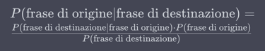

# Machine Translation

### Indice degli argomenti

* [Machine Translation](#machine-translation)
    * [Indice degli argomenti](#indice-degli-argomenti)
    * [Machine Translation](#machine-translation-1)
    * [Apprendimento tramite Testi Paralleli](#apprendimento-tramite-testi-paralleli)
        * [Dataset utilizzati per addestrare modelli di machine translation](#dataset-utilizzati-per-addestrare-modelli-di-machine-translation)
    * [Valutazione](#valutazione)
        * [BLEU](#bleu)
        * [Precisione n-gramma `p_n`](#precisione-n-gramma-pn)
        * [Brevity penalty `BP`](#brevity-penalty-bp)
    * [Statistical MT](#statistical-mt)
        * [Noisy channel](#noisy-channel)
        * [IBM alignment models](#ibm-alignment-models)
    * [Neural MT](#neural-mt)
        * [Training](#training)
    * [Self attention](#self-attention)

---

## Machine Translation

[~ Vai all'indice](#indice-degli-argomenti)

**Definizione:** La **machine translation** (traduzione automatica) è il processo di traduzione di testi da una lingua
all'altra utilizzando software o algoritmi automatizzati. Questo task coinvolge la conversione di un testo scritto in
una lingua di origine in un testo equivalente in una lingua di destinazione.

**Funzionamento:** La machine translation può essere realizzata attraverso due principali approcci:

- **Statistico:** In questo approccio, il sistema di traduzione automatica si basa su modelli statistici che utilizzano
  frequenze e probabilità per associare parole e frasi nelle due lingue. Questo metodo ha perso popolarità con l'avvento
  delle reti neurali.

- **Neurale:** Il metodo di traduzione automatica neurale utilizza reti neurali profonde per apprendere direttamente
  dalle coppie di frasi tradotte, catturando relazioni complesse tra le lingue. Questo approccio ha dimostrato
  prestazioni eccezionali negli ultimi anni.

**Applicazioni:** La machine translation ha numerose applicazioni, tra cui:

- Traduzione di documenti e testi commerciali.
- Traduzione in tempo reale di conversazioni durante videoconferenze o chat online.
- Traduzione di contenuti web e pagine internet.
- Localizzazione di software e applicazioni.
- Sottotitolazione e traduzione automatica di video e programmi televisivi.
- Traduzione di testi medici e scientifici.

---

## Apprendimento tramite Testi Paralleli

[~ Vai all'indice](#indice-degli-argomenti)

**Funzionamento:** L'apprendimento tramite testi paralleli è un metodo utilizzato nell'ambito della machine translation
e del Natural Language Processing (NLP) per allenare modelli di traduzione automatica. Ecco come funziona:

1. **Raccolta di testi paralleli:** Inizialmente, è necessario raccogliere una vasta quantità di testi che sono
   disponibili in due o più lingue diverse. Questi testi dovrebbero avere una corrispondenza significativa tra le
   lingue, il che significa che le frasi o le porzioni di testo in una lingua devono essere traducibili in modo coerente
   nell'altra lingua.

2. **Allineamento dei testi:** Il passo successivo è l'allineamento dei testi paralleli. Questo processo consiste nel
   creare coppie di frasi o segmenti di testo che sono equivalenti tra le lingue di origine e di destinazione. Ad
   esempio, se si ha un testo in italiano e la sua traduzione in inglese, si creano coppie di frasi corrispondenti tra
   le due lingue.

3. **Allenamento del modello:** Una volta che si dispongono di testi paralleli allineati, è possibile utilizzarli per
   allenare il modello di traduzione automatica. Il modello può essere basato su approcci statistici o neurali, ma negli
   ultimi anni, i modelli neurali, come le reti neurali profonde, hanno dimostrato di essere particolarmente efficaci
   per questo compito.

4. **Ottimizzazione del modello:** Durante il processo di allenamento, il modello cerca di apprendere le relazioni tra
   le frasi nelle diverse lingue per tradurle in modo accurato. Questo comporta l'ottimizzazione dei parametri del
   modello attraverso l'analisi dei dati di allenamento e l'aggiustamento di pesi e parametri per minimizzare l'errore
   di traduzione.

5. **Valutazione e affinamento:** Dopo l'allenamento iniziale, il modello viene valutato utilizzando dati di test
   separati per misurare la sua capacità di traduzione. Se necessario, il modello può essere ulteriormente affinato o
   ottimizzato per migliorare le prestazioni.

L'apprendimento tramite testi paralleli è un metodo potente per creare sistemi di traduzione automatica, poiché consente
al modello di apprendere direttamente dalla comparazione tra le lingue. Tuttavia, è importante disporre di un ampio e di
alta qualità dataset di testi paralleli per ottenere risultati accurati e coerenti nella traduzione automatica.

### Dataset utilizzati per addestrare modelli di machine translation

Ci sono diversi dataset noti utilizzati per addestrare modelli di traduzione automatica e altri modelli relativi al
NLP (Natural Language Processing). Ecco alcuni dei dataset più famosi per questo tipo di task:

1. **WMT (Workshop on Machine Translation):** Questo è uno dei dataset più noti per la traduzione automatica. Ogni anno,
   il workshop rilascia dataset contenenti testi paralleli in diverse lingue. I dati includono spesso testi tratti da
   fonti come articoli di giornale, siti web, e altro ancora.

2. **Europarl:** Questo dataset contiene discorsi pronunciati nel Parlamento europeo in molte lingue europee. È spesso
   utilizzato come dataset di riferimento per la traduzione automatica.

3. **OpenSubtitles:** Contiene sottotitoli di film e programmi TV in diverse lingue. Questo dataset è ampiamente
   utilizzato per l'allenamento di modelli di traduzione automatica.

4. **TED Talks:** Questo dataset contiene trascrizioni di discorsi TED in diverse lingue. È spesso utilizzato per
   l'allenamento di modelli di traduzione automatica e per task di sintesi vocale.

5. **Common Crawl:** Contiene testi estratti da pagine web in molte lingue. È un dataset molto grande e diversificato
   utilizzato per vari task di NLP, inclusa la traduzione automatica.

6. **MultiUN (UN Corpus):** Questo dataset contiene traduzioni di documenti delle Nazioni Unite in molte lingue. È
   utilizzato
   principalmente per la traduzione automatica a fini di cooperazione internazionale.

7. **ParaCrawl:** È un dataset che raccoglie testi estratti da pagine web multilingue. È stato creato per migliorare la
   disponibilità di dati per la traduzione automatica.

8. **IWSLT (International Workshop on Spoken Language Translation):** Questo workshop rilascia dataset di traduzione
   automatica incentrati sulla traduzione di lingua parlata. È utilizzato per task di traduzione di conversazioni e
   discorsi.

9. **Tatoeba:** Una collezione collaborativa di frasi in diverse lingue, spesso con traduzioni. È utilizzato per scopi
   educativi e per l'allenamento di modelli di traduzione automatica.

10. **WikiMatrix:** Estratto da Wikipedia, questo dataset contiene coppie di frasi che sono state allineate tra diverse
    lingue. È ampiamente utilizzato per la traduzione automatica basata su modelli neurali.

Questi sono solo alcuni degli esempi di dataset utilizzati per l'allenamento di modelli di traduzione automatica. La
scelta del dataset dipende spesso dalla lingua di interesse e dalla specifica applicazione. È importante selezionare un
dataset di alta qualità e rappresentativo per ottenere risultati accurati nella traduzione automatica.

---

## Valutazione

[~ Vai all'indice](#indice-degli-argomenti)

Il processo di valutazione dei sistemi di traduzione automatica è fondamentale per misurare la qualità delle traduzioni
prodotte dai modelli. Una delle metriche più comuni utilizzate per valutare la qualità delle traduzioni è la BLEU (
Bilingual Evaluation Understudy). Ecco come funziona il processo di valutazione e cosa rappresenta la BLEU:

**Processo di valutazione:**

1. **Creazione di un set di riferimento:** Per valutare la qualità delle traduzioni, è necessario disporre di un set di
   testo di riferimento (o "gold standard") che contiene traduzioni umane di testi di origine. Questo set di riferimento
   viene creato manualmente e rappresenta la traduzione di alta qualità che si desidera valutare.

2. **Generazione di traduzioni:** Il sistema di traduzione automatica (ad esempio, un modello neurale) genera traduzioni
   per gli stessi testi di origine presenti nel set di riferimento.

3. **Calcolo della metrica:** La metrica BLEU viene quindi utilizzata per confrontare le traduzioni generate dal sistema
   con le traduzioni umane di riferimento. La BLEU confronta le frasi nel testo generato con le frasi nel testo di
   riferimento e assegna un punteggio di similitudine basato su varie misurazioni.

**BLEU (Bilingual Evaluation Understudy):**
La BLEU è una delle metriche più comunemente utilizzate per la valutazione automatica delle traduzioni. Questa metrica
tiene conto della precisione delle traduzioni rispetto al set di riferimento. Ecco come funziona la BLEU:

1. **N-gram overlap:** La BLEU calcola la precisione dell'overlap degli n-grammi (sequenze di n parole consecutive) tra
   le traduzioni generate e il testo di riferimento. Questo significa che valuta quanto le parole e le sequenze di
   parole nel testo generato corrispondono a quelle nel testo di riferimento.

2. **Ponderazione n-gram:** La BLEU assegna punteggi più alti a traduzioni che corrispondono a n-grammi più lunghi, in
   modo da incoraggiare traduzioni più fluide e coerenti.

3. **Brevità della traduzione:** Per evitare traduzioni troppo corte, la BLEU tiene conto della brevità della traduzione
   rispetto al testo di riferimento.

4. **Normalizzazione:** La BLEU normalizza il punteggio finale in modo da ottenere un valore compreso tra 0 e 1, dove 1
   rappresenta una corrispondenza perfetta tra la traduzione generata e il testo di riferimento.

In generale, un punteggio BLEU più alto indica una migliore corrispondenza tra la traduzione automatica e il testo di
riferimento. Tuttavia, va notato che la BLEU ha alcune limitazioni, come la mancanza di sensibilità alla coerenza
semantica e alla fluidità delle traduzioni. Pertanto, è spesso utilizzata insieme ad altre metriche per ottenere una
valutazione più completa delle traduzioni automatiche.

### BLEU

**Spiegazione Formale:**
La BLEU è una metrica di valutazione automatica utilizzata per misurare la qualità delle traduzioni automatiche in base
alla loro similitudine con le traduzioni umane di riferimento. La formula della BLEU è la seguente:

```text
BLEU = BP * exp(∑(n=1 to N) w_n * log(p_n))
```

Dove:

- `BP` è il fattore di penalizzazione per la brevità della traduzione (Brevity Penalty).
- `N` è il numero massimo di n-grammi considerati (solitamente 4).
- `w_n` sono i pesi assegnati a ciascun n-gramma (solitamente tutti impostati a 0.25).
- `p_n` è la precisione dell'n-gramma.

La precisione dell'n-gramma `p_n` è calcolata come il numero di n-grammi corrispondenti tra la traduzione generata e il
testo di riferimento, diviso per il numero totale di n-grammi nella traduzione generata. In altre parole, misura quanto
le sequenze di parole nella traduzione generata corrispondono a quelle nel testo di riferimento per vari valori di n.

**Spiegazione Sintetica:**
La BLEU è una metrica che aiuta a valutare la qualità delle traduzioni automatiche. Funziona confrontando la traduzione
generata da un computer con traduzioni fatte da persone. Ecco come funziona in parole semplici:

1. Guarda quanto le parole e le frasi nella traduzione automatica sono simili a quelle nelle traduzioni umane di
   riferimento.

2. Dà punteggi più alti se le traduzioni hanno frasi lunghe e simili alle traduzioni umane.

3. Controlla che la traduzione non sia troppo breve rispetto alle traduzioni di riferimento.

4. Calcola un punteggio finale che ti dice quanto la traduzione automatica sia simile alle traduzioni umane. Un
   punteggio più alto è migliore.

In breve, la BLEU aiuta a capire quanto bene un computer può tradurre rispetto alle persone, usando una formula che
guarda le parole, le frasi e la lunghezza della traduzione.

### Precisione n-gramma `p_n`

**Spiegazione Formale:**
La precisione dell'n-gramma `p_n` è una parte importante della formula BLEU. Essa misura quanto le sequenze di n parole
consecutive nella traduzione generata corrispondono alle sequenze di n parole consecutive nei testi di riferimento
forniti da esseri umani. La formula per calcolare la precisione dell'n-gramma `p_n` è la seguente:

```text
p_n = (Numero di n-grammi corrispondenti tra la traduzione generata e il testo di riferimento) / (Numero totale di
n-grammi nella traduzione generata)
```

In altre parole, `p_n` conta quanti frammenti di n parole consecutivi nella traduzione generata coincidono con quelli
nei testi di riferimento e divide questo numero per il totale di frammenti di n parole consecutivi nella traduzione
generata. Questo calcolo misura quanto le parti della traduzione generata sono simili alle parti dei testi di
riferimento per un dato valore di n.

**Spiegazione Sintetica:**
La precisione dell'n-gramma `p_n` è una parte della BLEU che guarda quanto le frasi nella traduzione sono simili a
quelle nei testi di riferimento. Si fa contando quanti pezzi di n parole consecutive corrispondono tra la traduzione
generata e i testi di riferimento e dividendo questo numero per il totale di pezzi di n parole consecutive nella
traduzione generata. Questo ci dice quanto le parti della traduzione sono simili alle parti dei testi di riferimento per
una determinata lunghezza di n parole consecutive.

### Brevity penalty `BP`

**Spiegazione Formale:**
Il "Brevity Penalty" è un componente della formula BLEU che viene utilizzato per penalizzare le traduzioni generiche che
sono significativamente più corte dei testi di riferimento. Questo è importante perché una traduzione troppo breve
potrebbe ottenere un punteggio elevato di precisione n-gramma senza rappresentare efficacemente il contenuto del testo
originale. La formula per calcolare il "Brevity Penalty" è la seguente:

```text
Brevity Penalty = min(1, (Lunghezza della traduzione generata / Lunghezza del testo di riferimento più breve))^B
```

Dove:

- "Lunghezza della traduzione generata" è il numero di parole nella traduzione generata.
- "Lunghezza del testo di riferimento più breve" è la lunghezza del testo di riferimento più corto tra quelli forniti.
- "B" è un esponente, spesso impostato a 0.25.

In poche parole, il "Brevity Penalty" assicura che la lunghezza della traduzione generata sia confrontata con la
lunghezza del testo di riferimento più breve e applica una penalità se la traduzione generata è troppo breve rispetto a
questo riferimento.

**Spiegazione Sintetica:**
Il "Brevity Penalty" è un modo per penalizzare le traduzioni troppo brevi. Se una traduzione è molto più corta dei testi
di riferimento, otterrà una penalità. Questo aiuta a evitare che le traduzioni troppo corte ottengano punteggi elevati
nella valutazione BLEU.

---

## Statistical MT

[~ Vai all'indice](#indice-degli-argomenti)

**Spiegazione Formale:**
La "Statistical Machine Translation" (Traduzione Automatica Statistica) è un paradigma di traduzione automatica basato
su modelli statistici. Questi modelli utilizzano statistiche e probabilità per apprendere come tradurre da una lingua di
origine a una lingua di destinazione. Il processo di SMT coinvolge la raccolta di enormi quantità di testi paralleli,
ovvero testi in cui la stessa informazione è espressa in due lingue diverse. I modelli statistici utilizzano queste
coppie di testi per stimare la probabilità di traduzione di parole, frasi o strutture linguistiche da una lingua
all'altra. Tra le tecniche comuni utilizzate nella SMT ci sono i modelli di linguaggio, i modelli di traduzione e
l'allineamento di frasi.

**Spiegazione Sintetica:**
La "Statistical Machine Translation" è un modo sofisticato di far tradurre automaticamente testi da una lingua a
un'altra. Funziona imparando dalle traduzioni esistenti in due lingue diverse e usando matematica per capire come
tradurre parole e frasi. In breve, è come insegnare a un computer a tradurre guardando molte traduzioni già fatte.

### Noisy channel

**Spiegazione Formale:**
Il concetto di "noisy channel" (canale rumoroso) è una parte fondamentale della teoria dell'Information Theory e viene
spesso utilizzato in contesti di elaborazione del linguaggio naturale, compresa la traduzione automatica. In un contesto
di traduzione automatica, il "noisy channel" è un modello probabilistico che rappresenta l'idea che una sequenza di
parole in una lingua di origine è stata "corrotta" in qualche modo durante la traduzione in una lingua di destinazione.

Matematicamente, il modello del "noisy channel" può essere rappresentato utilizzando la formula di Bayes:



Dove:

- P(frase di origine | frase di destinazione) rappresenta la probabilità che la frase di origine sia
  stata tradotta nella frase di destinazione.
- P(frase di destinazione | frase di origine) è la probabilità di ottenere la frase di destinazione
  data la frase di origine, detta anche "modello di traduzione".
- P(frase di origine) è la probabilità a priori della frase di origine.
- P(frase di destinazione) è la probabilità a priori della frase di destinazione.

Il "canale rumoroso" rappresenta il processo attraverso il quale la traduzione dalla lingua di origine alla lingua di
destinazione introduce "rumore" o errori nel testo tradotto.

**Spiegazione Sintetica:**
Il concetto di "noisy channel" è come un modello matematico che ci aiuta a capire come le parole o le frasi possono
essere tradotte con errori o rumore quando passano da una lingua all'altra. È come se ci fosse un canale rumoroso che fa
sì che le traduzioni non siano sempre perfette. Questo concetto è molto utile nella traduzione automatica e
nell'elaborazione del linguaggio naturale.

### IBM alignment models

**Spiegazione Formale:**
I modelli di allineamento IBM sono un insieme di modelli statistici utilizzati nella traduzione automatica, in
particolare nella traduzione automatica statistica (SMT). Sono chiamati così in onore dell'IBM, l'azienda che ha
sviluppato questi modelli.

Questi modelli sono progettati per affrontare il problema dell'allineamento tra parole in due lingue diverse durante il
processo di traduzione. In altre parole, determinano quale parola in una lingua sorgente corrisponde a quale parola in
una lingua di destinazione. Gli IBM alignment models includono diverse versioni, con IBM Model 1 e Model 2 che sono i
più noti.

Il Modello IBM 1 è un modello di allineamento di parole semplice e statistico che assegna probabilità a diverse
corrispondenze di parole tra le due lingue in base ai dati di allenamento. Il Modello IBM 2 estende il Modello IBM 1
introducendo l'idea di allineamenti nascosti, il che significa che una parola in una lingua di origine può generare più
di una parola nella lingua di destinazione.

Applicazioni principali:

- **Traduzione automatica**: Questi modelli sono stati utilizzati nei primi sistemi di traduzione automatica statistica
  per migliorare la qualità delle traduzioni.
- **Allineamento di testo bilingue**: Possono essere utilizzati per allineare frasi o documenti in due lingue diverse,
  il che è utile in applicazioni come il riconoscimento ottico dei caratteri.

**Spiegazione Sintetica:**
I modelli di allineamento IBM sono strumenti matematici che aiutano a trovare quali parole in una lingua corrispondono a
quali parole in un'altra lingua. Sono stati creati da IBM e sono stati utilizzati principalmente nella traduzione
automatica e nell'allineamento di testi in lingue diverse. Ci sono diverse versioni di questi modelli, ma tutti sono
basati su statistiche e aiutano a migliorare la precisione delle traduzioni.

---

## Neural MT

[~ Vai all'indice](#indice-degli-argomenti)

**Spiegazione Formale:**
L'architettura Encoder-Decoder è un modello ampiamente utilizzato in traduzione automatica neurale (NMT) per convertire
un testo da una lingua di origine a una lingua di destinazione. Ecco come funziona:

1. **Encoder (Codificatore)**: Inizia con il testo nella lingua di origine. L'encoder è una rete neurale ricorrente (
   RNN) o una rete neurale trasformazionale (come un transformer) che elabora questo testo passo dopo passo. Ad ogni
   passo, l'encoder guarda una parola o un token del testo e cattura le informazioni significative su quella parola.
   Queste informazioni vengono conservate in un vettore chiamato "vettore latente" o "vettore di contesto". Alla fine
   del processo, l'encoder ha un vettore di contesto che rappresenta l'intero testo di origine.

2. **Decoder (Decodificatore)**: Ora, il vettore di contesto dell'encoder viene passato al decoder. Il decoder è anche
   una rete neurale, ma è progettato per generare il testo nella lingua di destinazione. Inizia con un token speciale di
   inizio e genera uno alla volta i token della lingua di destinazione. Ogni token generato dipende dal vettore di
   contesto e dai token precedenti generati. Il processo continua fino a quando non viene generato un token speciale di
   fine o fino a quando il modello raggiunge una lunghezza massima prestabilita.

3. **Addestramento**: L'architettura viene addestrata su coppie di frasi bilingui (testo di origine e traduzione in
   lingua di destinazione). Durante l'addestramento, il modello impara a generare traduzioni accurate minimizzando
   l'errore tra le traduzioni generate e le traduzioni di riferimento nei dati di addestramento.

**Spiegazione Sintetica:**
L'architettura Encoder-Decoder è come un traduttore automatico neurale. L'encoder legge il testo di partenza e lo
comprende, creando un vettore di contesto. Il decoder prende questo vettore e crea il testo di destinazione. Addestrando
questa architettura su molti esempi di traduzione, il modello impara a tradurre automaticamente da una lingua all'altra.
È come avere un interprete virtuale nel mondo della traduzione automatica.

### Training

**Addestramento:**
Il processo di addestramento di un modello di traduzione automatica neurale (NMT) basato sull'architettura
Encoder-Decoder coinvolge i seguenti passaggi:

1. **Preparazione dei dati**: Si inizia raccogliendo un ampio dataset di coppie di frasi bilingui, cioè frasi nella
   lingua di origine e le loro traduzioni nella lingua di destinazione. Questi dati costituiscono il set di
   addestramento.

2. **Tokenizzazione**: Le frasi nei dataset vengono suddivise in token o parole, in modo che il modello possa trattarle
   in unità più piccole. Ad esempio, "I love cats" viene suddiviso in ["I", "love", "cats"].

3. **Addestramento del modello**: Il modello Encoder-Decoder viene addestrato utilizzando queste coppie di frasi
   tokenizzate. Durante l'addestramento, il modello cerca di minimizzare l'errore tra la traduzione che genera per una
   frase di origine e la traduzione reale presente nei dati di addestramento. Ciò viene fatto regolando i pesi delle
   connessioni neurali all'interno del modello attraverso un processo chiamato "backpropagation" e utilizzando un
   ottimizzatore come l'Adam optimizer.

**Prestazioni in Funzione della Lunghezza delle Frasi di Input:**
Le prestazioni dei modelli NMT possono variare in base alla lunghezza delle frasi di input. In generale, i modelli
possono avere difficoltà a tradurre frasi molto lunghe perché il vettore di contesto prodotto dall'encoder potrebbe non
essere abbastanza grande da catturare tutte le informazioni importanti. Inoltre, frasi lunghe richiedono più tempo per
essere processate, il che può rallentare l'output.

Per affrontare questo problema, possono essere utilizzate strategie come la "truncation" (troncamento) o la "padding" (
aggiunta di token di riempimento) per adattare le frasi di input a una lunghezza fissa. Tuttavia, ciò potrebbe
comportare la perdita di informazioni importanti.

**Applicazione dell'Attention:**
L'attention è un componente chiave nelle architetture NMT basate su Transformer. Durante l'addestramento e l'inferenza,
l'attention consente al modello di "prestare attenzione" a parti specifiche delle frasi di origine mentre genera la
traduzione. Questo è utile per gestire frasi lunghe e catturare le relazioni tra le parole.

L'attention funziona calcolando un punteggio di attenzione per ciascuna coppia di parole tra la frase di origine e la
frase di destinazione. I punteggi più alti indicano quali parole sono rilevanti durante la traduzione. Questi punteggi
vengono quindi utilizzati per pesare l'importanza delle parole nell'input durante la generazione dell'output.

In breve, l'attention permette al modello di concentrarsi sulle parti rilevanti delle frasi di origine durante il
processo di traduzione, migliorando così la qualità delle traduzioni e affrontando le sfide legate alla lunghezza delle
frasi di input.

---

## Self attention

[~ Vai all'indice](#indice-degli-argomenti)

La self-attention, anche conosciuta come intra-attention o auto-attenzione, è un componente chiave nell'architettura del
Transformer, spesso utilizzata nell'ambito della traduzione automatica neurale (NMT). In questo contesto, la
self-attention è utilizzata per catturare le relazioni tra le parole all'interno della stessa frase di origine o
destinazione. Ecco come funziona:

**Processo di Self-Attention:**

1. **Creazione di Query, Key e Value:** Per ogni parola nella frase di input (encoder) o output (decoder), la
   self-attention crea tre vettori:

    - Query: Questo vettore rappresenta la parola di interesse ed è utilizzato per confrontarla con le altre parole
      nella frase.

    - Key: Il vettore chiave viene utilizzato per calcolare quanto ciascuna parola è rilevante per la parola di
      interesse (query).

    - Value: Il vettore valore contiene le informazioni effettive associate a ogni parola.

2. **Calcolo dei Punteggi di Similarità:** Per calcolare quanto ciascuna parola è rilevante per la parola di interesse (
   query), si esegue un prodotto scalare tra la query e le chiavi di tutte le altre parole nella frase. Questo genera un
   insieme di punteggi di similarità tra la query e le altre parole.

3. **Applicazione delle Ponderazioni:** I punteggi di similarità vengono passati attraverso una funzione softmax per
   ottenere un insieme di ponderazioni che indicano quanto peso dare a ciascuna parola nella frase di valore (value). Le
   parole con punteggi più alti avranno un peso maggiore, il che significa che sono considerate più rilevanti per la
   parola di interesse.

4. **Calcolo dell'Output Ponderato:** Infine, si calcola un vettore di output sommando i prodotti delle ponderazioni con
   i vettori di valore. Questo vettore di output contiene le informazioni aggregare dalle altre parole sulla parola di
   interesse.

**Benefici nella Traduzione Automatica:**

Nel contesto della traduzione automatica neurale, la self-attention è estremamente utile perché permette al modello di
considerare le parole in una frase in modo contestuale. Questo è particolarmente importante quando si traducono lingue
con diverse strutture grammaticali o quando si devono gestire frasi lunghe. La self-attention aiuta il modello a "
prestare attenzione" alle parole chiave e alle relazioni tra di esse, migliorando la qualità delle traduzioni.

In breve, la self-attention è un meccanismo fondamentale nel Transformer che consente al modello di catturare le
dipendenze a lungo raggio e di eseguire la traduzione automatica in modo più accurato e contestualmente informato.